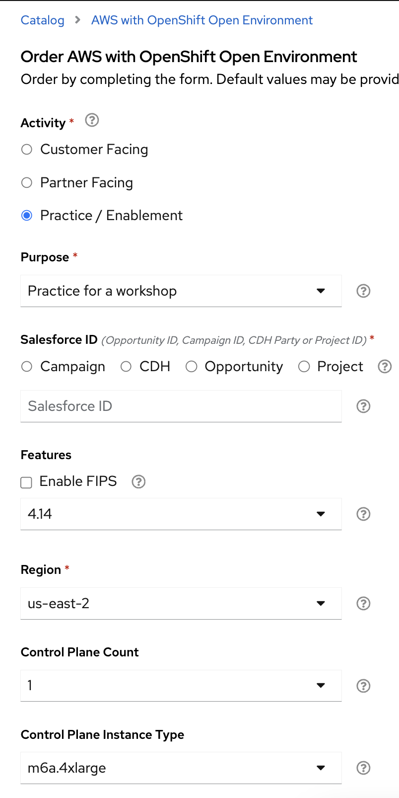
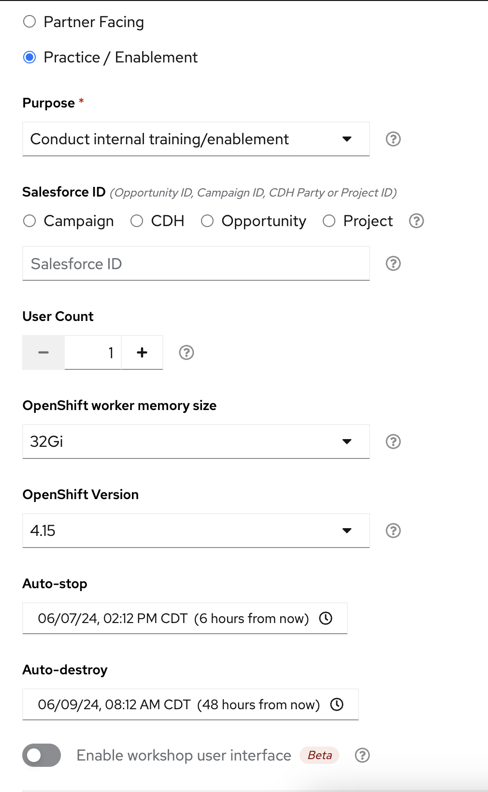
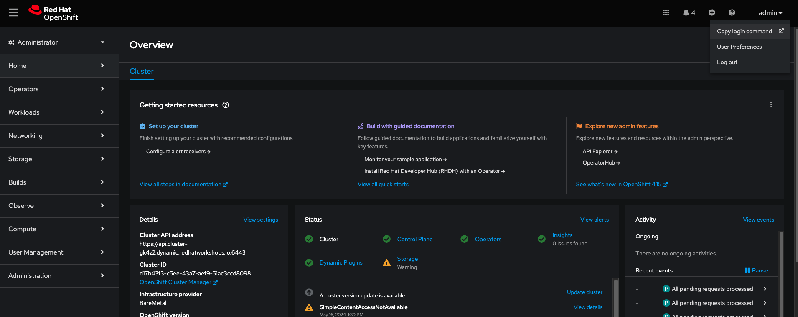
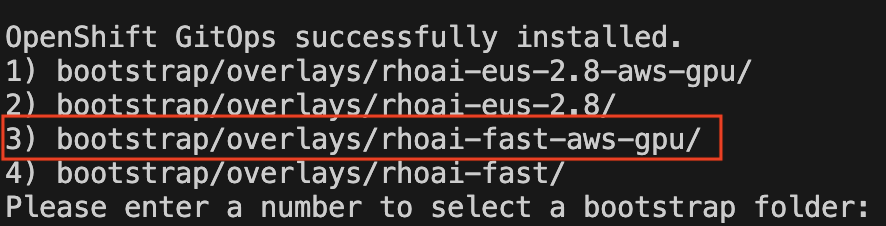
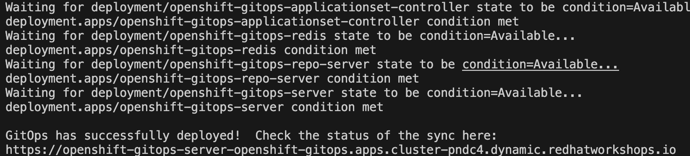
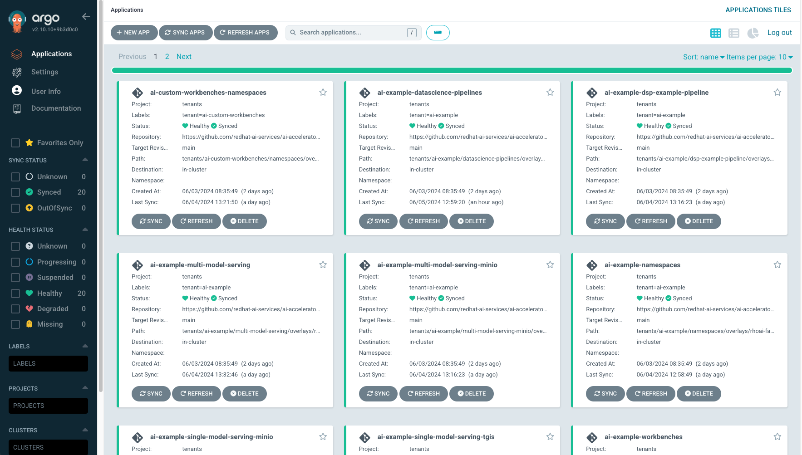

:preinstall_operators: %preinstall_operators%

== Welcome to the Red Hat OpenShift Artificial Intelligence Accelerator Bootcamp

For this bootcamp, provision 3 instances of the Red Hat OpenShift Container Platform Cluster from demo.redhat.com.

These would be used as demo, dev and prod clusters in this bootcamp.

### Spin up Demo Cluster
Navigate to https://demo.redhat.com/catalog?search=aws&item=babylon-catalog-prod%2Fsandboxes-gpte.sandbox-ocp.prod and order a _**AWS with OpenShift Open Environment**_.

IMPORTANT: The Control Plane Instance Type should be set to _**m6a.4xlarge**_
Please make sure this is set correctly or your cluster will not have enough resources

This will take around 1-1:20 hrs.

## Spin up Dev and Prod Cluster

Navigate to https://demo.redhat.com/catalog?search=Red+Hat+OpenShift+Container+Platform+Cluster&item=babylon-catalog-prod%2Fopenshift-cnv.ocpmulti-wksp-cnv.prod and order 2 _**Red Hat OpenShift Container Platform Cluster**_. One for the _**Dev**_ environment and one for the _**Prod**_ environment. Create using the defaults:

**We'll be using and setting up the DEV and PROD clusters for the later sections.**

## Install and Setup RHOAI & Components: DEMO Environment

The environment install and setup will be performed with the help of the Red Hat AI Accelerator repository. This repo is intended to provide a core set of OpenShift features that would commonly be used for a Data Science environment, but can also be highly customized for specific scenarios.

## DEMO cluster
Follow the following steps to complete the install and setup:

. After the cluster is running and ready, log in as the admin.

. In the top right drop down, select the _**Copy Login Command**_. Enter credentials again. Copy the login token as shown in the image. Paste and run the command in your local terminal. This should log you into the cluster through the terminal.

NOTE: If the `oc login` command fails because of certificate issue, use: `--insecure-skip-tls-verify`

[start=3]
. Git clone the following repository to your local machine:
----
git clone https://github.com/redhat-ai-services/ai-accelerator.git
----

[start=4]
. Navigate to the cloned folder with the command:
[source,terminal]
----
cd ai-accelerator/
----

[start=5]
. Run the bootstrap script by running the bootstrap.sh script
[source,terminal]
----
./bootstrap.sh
----

* This will first install the GitOps Operator and then provide the user with the following overlays:
* If the script times out waiting for GitOps to come up, you may need to run the bootstrap script again.

[start=6]
. For _**Demo**_ cluster type the number 3 and press Enter. 

This will install all the applications in the bootstrap script and also provide a openshift-gitops-server (ArgoCD) link.

[start=7]
. Log into the Argo CD link with the Openshift credentials and wait till everything syncs successfully.

This will take around 25-30 minutes for everything to spin up.

This will install RHOAI and related operators. Since we are using GPUs for the demo instance, it will also install the Nvidia GPU Operator and the Node Feature Discovery (NFD) Operator.

This GPU overlay also uses _**MachineAutoscalers**_. Since there are Inferencing Service examples that use GPUs, a _**g5.2xlarge**_ machineset (with GPU) will spin up. This can take a few minutes.

[NOTE]
====
If the granite inference service fails to spin up, delete the deployment and Argo should redeploy it.

[SOURCE]
----
oc delete deployment granite-predictor-00001-deployment -n ai-example-single-model-serving
----

====

We will cover the ai-accelerator project overview in a later section.

---
Continue using the _**DEMO**_ cluster for the exercises.