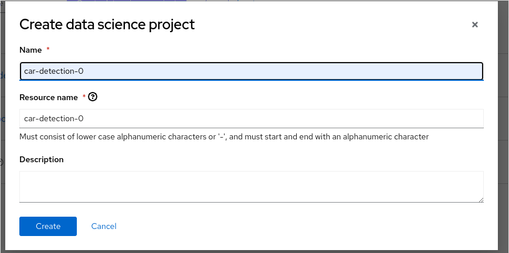
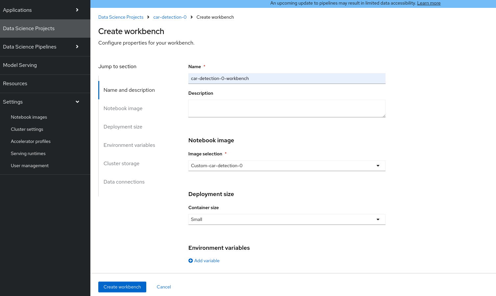
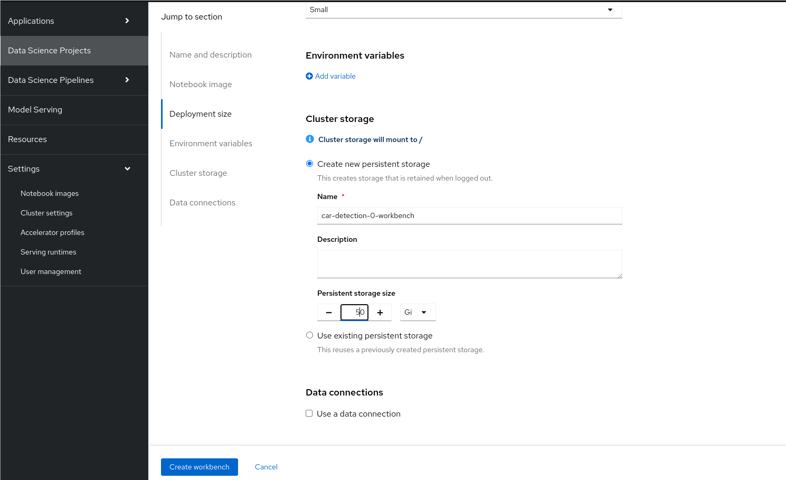
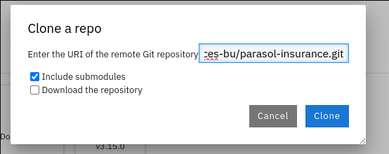

# Model Training with Custom Notebook

## In this module you will sync a git repo and run through a the parasol-insurnace Jupyter notebooks. 

We will use the custom image we created and uploaded before and we will create a workbench with the customer image we uploaded in module 04.  

## Steps to create workbench with a custom notebook

* A new repository named custom_notebook will get created in your quay.io account. This will get created as a Private repository. Convert it into a public repository.

* Create a data science project

* Create workbench with custom image.

* Change the Workbench Persistent Storage Size 

* Open Workbench and git clone parasol insuance repository https://github.com/rh-aiservices-bu/parasol-insurance.git

* Navigate to parasol-insurance/lab-materials/04 and run the notebooks 04-01-over-approach, 04-02-car-recognition, 04-03-model-retraining and 04-04-accident-recog

