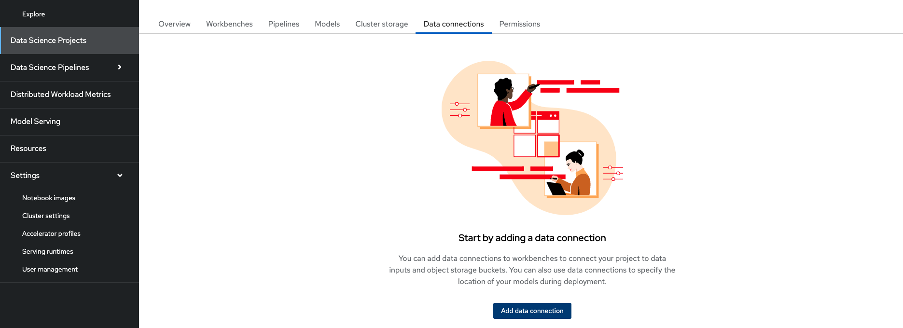
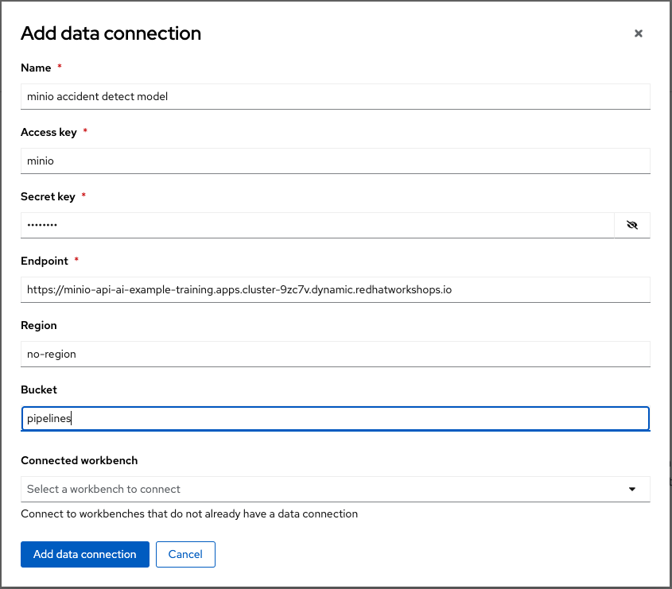
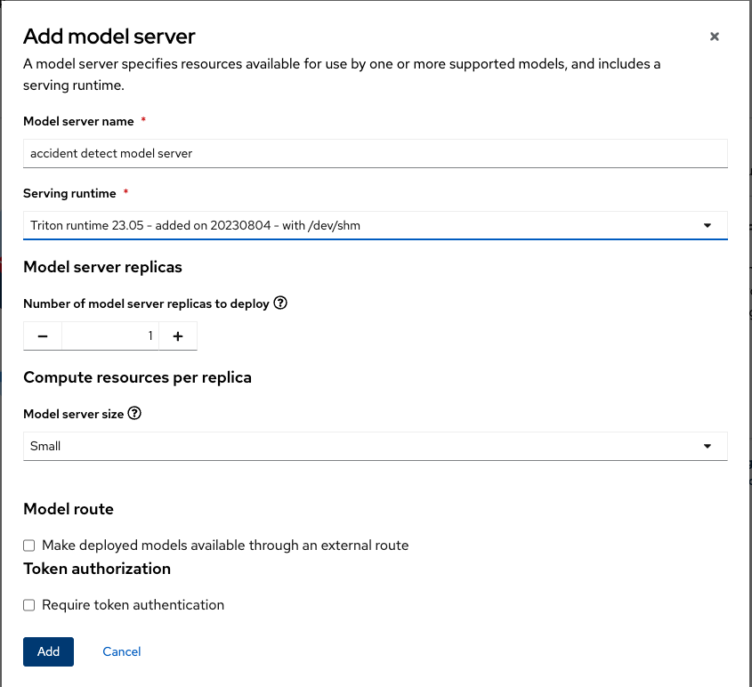
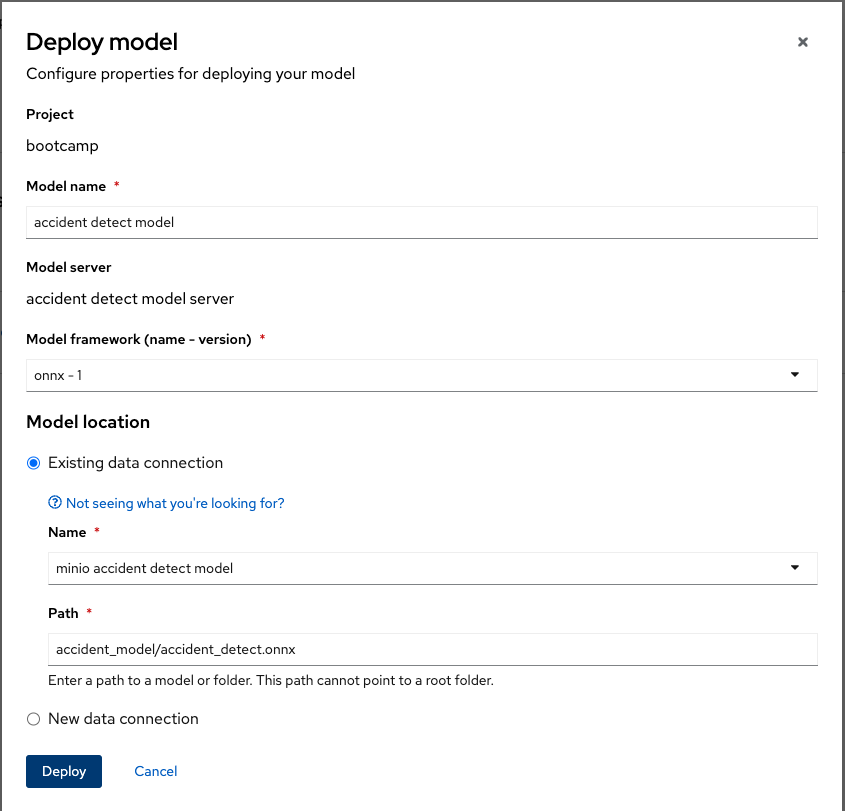
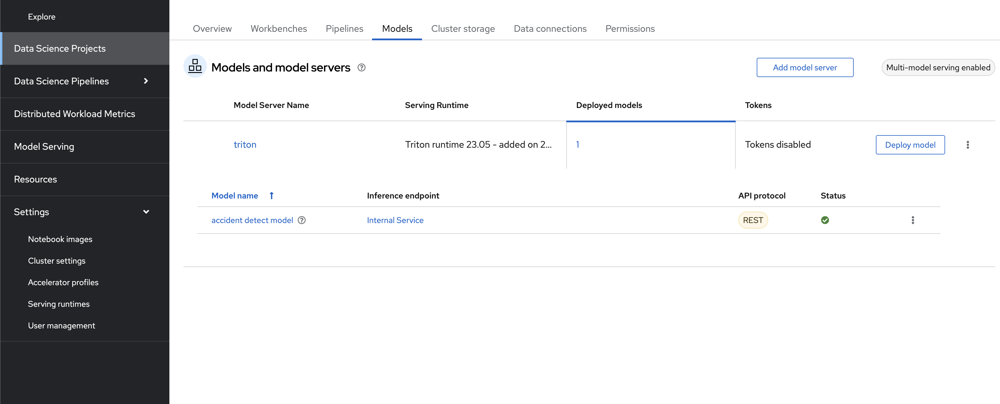

# Deploy a model from S3 using RHOAI and a Custom Serving runtime

In the previous sections we pushed a model to the s3 bucket (minio) created in the ai-example-training namespace. You should have got the output similar to this: File 'accident_detect.onnx' successfully uploaded to bucket 'pipelines' as 'accident_detect.onnx'.

In this section we serve this model in our RHOAI instance

## Custom Serving runtime

RHOAI supports the ability to add your own serving runtime. But it does not support the runtimes themselves. Therefore, it is up to you to configure, adjust and maintain your custom runtimes.

In this tutorial we will setup the Triton Runtime (NVIDIA Triton Inference Server). Use the following steps to add the runtime:

* Log in to your OpenShift AI with a user who is part of the RHOAI admin group

* Navigate to the Settings menu, then Serving Runtimes

image::images/ServingRuntimes.png[Serving runtimes]

* Click on the Add Serving Runtime button

* From the drop down menu, select Multi-model serving platform. The option for REST will be selected automatically

* Click on Start from scratch and in the window that opens up, paste the following YAML:

[source,yaml]
----
# Copyright 2021 IBM Corporation
#
# Licensed under the Apache License, Version 2.0 (the "License");
# you may not use this file except in compliance with the License.
# You may obtain a copy of the License at
#
#     http://www.apache.org/licenses/LICENSE-2.0
#
# Unless required by applicable law or agreed to in writing, software
# distributed under the License is distributed on an "AS IS" BASIS,
# WITHOUT WARRANTIES OR CONDITIONS OF ANY KIND, either express or implied.
# See the License for the specific language governing permissions and
# limitations under the License.
apiVersion: serving.kserve.io/v1alpha1
# kind: ClusterServingRuntime     ## changed by EG
kind: ServingRuntime
metadata:
  name: triton-23.05-20230804
  labels:
    name: triton-23.05-20230804
  annotations:
    maxLoadingConcurrency: "2"
    openshift.io/display-name: "Triton runtime 23.05 - added on 20230804 - with /dev/shm"
spec:
  supportedModelFormats:
    - name: keras
      version: "2" # 2.6.0
      autoSelect: true
    - name: onnx
      version: "1" # 1.5.3
      autoSelect: true
    - name: pytorch
      version: "1" # 1.8.0a0+17f8c32
      autoSelect: true
    - name: tensorflow
      version: "1" # 1.15.4
      autoSelect: true
    - name: tensorflow
      version: "2" # 2.3.1
      autoSelect: true
    - name: tensorrt
      version: "7" # 7.2.1
      autoSelect: true

  protocolVersions:
    - grpc-v2
  multiModel: true

  grpcEndpoint: "port:8085"
  grpcDataEndpoint: "port:8001"

  volumes:
    - name: shm
      emptyDir:
        medium: Memory
        sizeLimit: 2Gi
  containers:
    - name: triton
      # image: tritonserver-2:replace   ## changed by EG
      image: nvcr.io/nvidia/tritonserver:23.05-py3
      command: [/bin/sh]
      args:
        - -c
        - 'mkdir -p /models/_triton_models;
          chmod 777 /models/_triton_models;
          exec tritonserver
          "--model-repository=/models/_triton_models"
          "--model-control-mode=explicit"
          "--strict-model-config=false"
          "--strict-readiness=false"
          "--allow-http=true"
          "--allow-sagemaker=false"
          '
      volumeMounts:
        - name: shm
          mountPath: /dev/shm
      resources:
        requests:
          cpu: 500m
          memory: 1Gi
        limits:
          cpu: "5"
          memory: 1Gi
      livenessProbe:
        # the server is listening only on 127.0.0.1, so an httpGet probe sent
        # from the kublet running on the node cannot connect to the server
        # (not even with the Host header or host field)
        # exec a curl call to have the request originate from localhost in the
        # container
        exec:
          command:
            - curl
            - --fail
            - --silent
            - --show-error
            - --max-time
            - "9"
            - http://localhost:8000/v2/health/live
        initialDelaySeconds: 5
        periodSeconds: 30
        timeoutSeconds: 10
  builtInAdapter:
    serverType: triton
    runtimeManagementPort: 8001
    memBufferBytes: 134217728
    modelLoadingTimeoutMillis: 90000
----

* You will likely want to update the name, label and display name but it is not mandatory.

* Click Add

* Confirm the new Runtime is in the list, and re-order the list as needed. (the order chosen here is the order in which the users will see these choices)

## Data connection to S3 bucket

In the data science project we created, go to the Data connections tab and click on Add data connection

Fill in the details to where the accident_detect.onnx model is stored. It should look similar to this:

## Model server

Next we create a model server in RHOAI with the custom serving runtime that we created. To do this go to the Models tab and click on Add model server in the Multi-model serving platform section

Fill in the details in the form. It should look similar to this:

## Deploying the model with the custom serving runtime

In the model server that we created, click on Deploy model

Fill in the details in the form. It should look similar to this: 

After this the model should be deployed as follows: 

