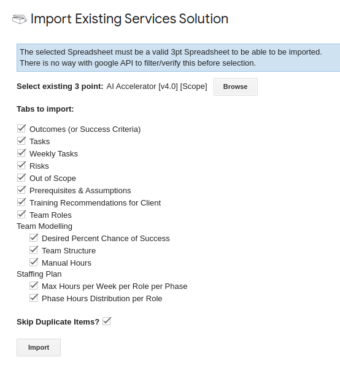
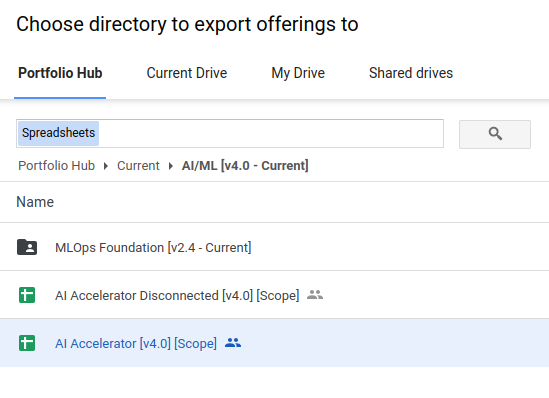

# Three-point estimate for Mock customer pre-engagement conversation

## Setting up the template
Open the three-point base template here: https://red.ht/ThreePointEstimate 

. Click the top right *'USE TEMPLATE'* blue button		
. A new spreadsheet is created in your Google drive, move to your project folder		
. Rename this document, e.g. "AI Bootcamp - CLIENT_NAME - AI Accelerator [Scope] [v1.0 - Current]"		
. Add yourself to the "Scoping Participants" tab for the "Task List Creation Participants"		
. Skip the "Opportunity Information" tab		
. To import the 'AI Accelerator' offering, click the following menu:
** 🧰 Red Hat Tools -> Import Existing Services Solution
** Give permission to the script to run as your RH Google account (click the menu item again if it doesn't work the first time)
+

+
** Click the 'Browse' button and navigate to _Portfolio Hub -> Current -> AI/ML [v4.0 - Current]_
+

+
** Select *AI Accelerator [v4.0] [Scope]* and click Select
** Click 'Import' and wait for the import to complete
. The tabs are organized in the order you should complete them, from left to right.
** Each tab has tab specific instructions to reference that go into more detail then the high level instructions here.
