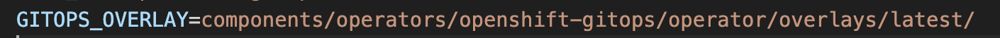
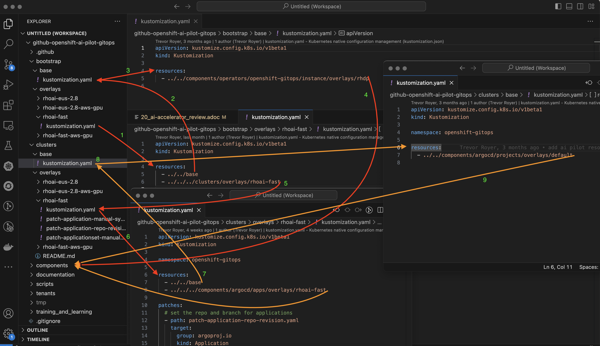
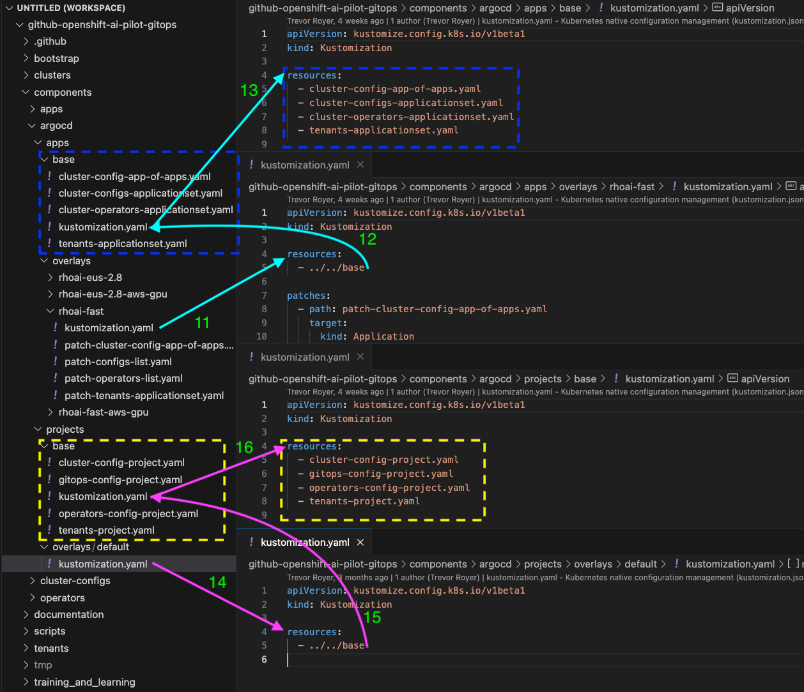
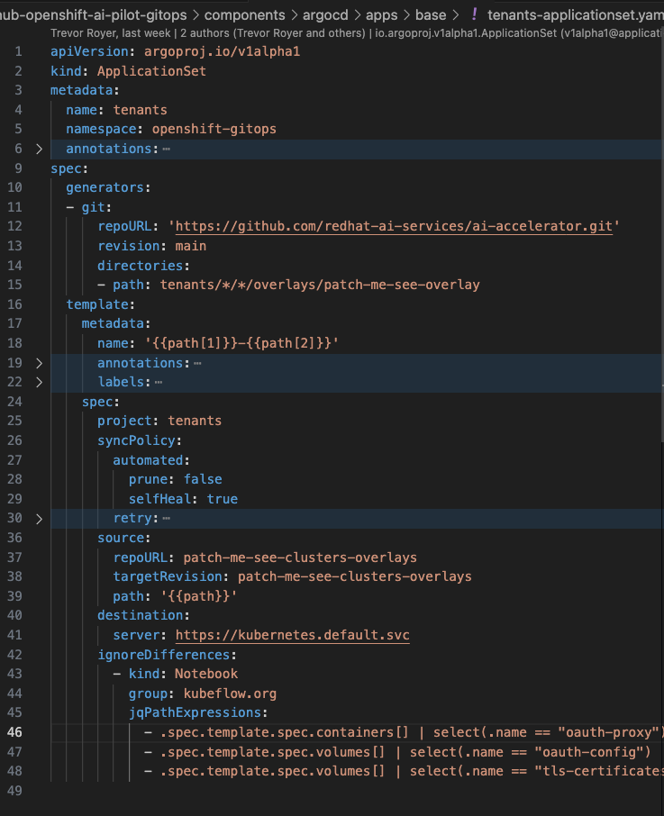
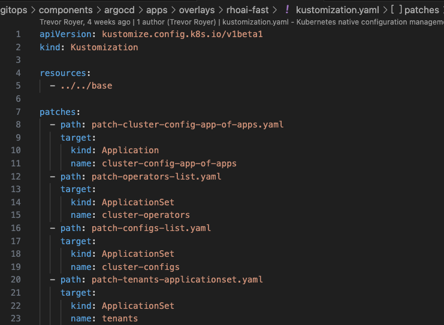
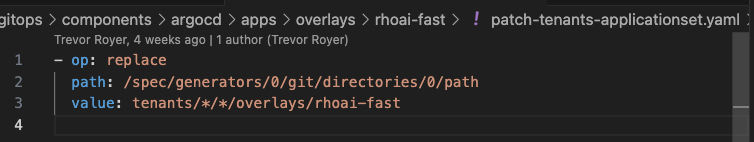
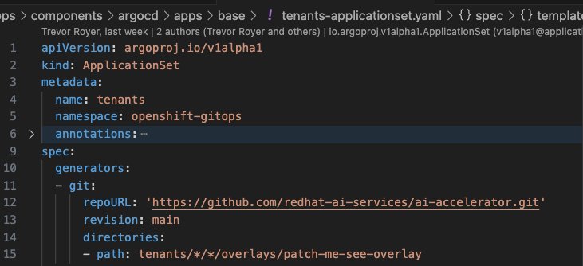
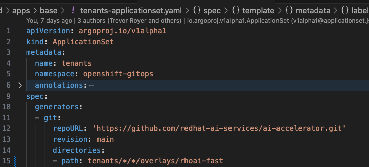

# ai-accelerator Project

The AI-accelerator project is an automated way to deploy RHOAI, relevent operators, and examples to a cluster.

Navigate to the ai-accelerator github project: https://github.com/redhat-ai-services/ai-accelerator

1. Read the README.
2. Navigate and read the https://github.com/redhat-ai-services/ai-accelerator/blob/main/documentation/overview.md[Project Overview documentation].
3. Navigate and read the https://github.com/redhat-ai-services/ai-accelerator/blob/main/documentation/installation.md[Installation documentation].

4. Navigate and read the https://github.com/redhat-ai-services/ai-accelerator/tree/main/tenants[Tenants documentation].

5. The ai-accelerator project installs Open Shift GitOps (ArgoCD) first, then uses ArgoCD to install RHOAI and the related operators. It also deploys examples such as inference services, a workbench, and pipelines.

* The list of operators it can install are in the https://github.com/redhat-ai-services/ai-accelerator/tree/main/components/operators[operators] folder.
*  Examples of model serving, workbench, and pipelines can be found in the https://github.com/redhat-ai-services/ai-accelerator/tree/main/tenants[tenants] folder.

## Kustomize

This project is set up with ArgoCD and Kustomize in mind. Meaning ArgoCD will handle the deployment of resources based on what Kustomize tells it. 

If you are unfamiliar with Kustomize, this is a very good tutorial: https://devopscube.com/kustomize-tutorial/[Learn more about Kustomize].

### Overview of Kustomize in ai-accelerator project
Let's try to understand how Kustomize is being used to deploy the different resources in the ai-accelerator.

1. When running the _**bootstrap.sh**_ script, it will apply the Open Shift GitOps operator by using Kustomize on the https://github.com/redhat-ai-services/ai-accelerator/blob/b90f025691e14d8e8a8d5ff3452107f8a0c8f48d/scripts/bootstrap.sh#L11[GitOps_Overlay] https://github.com/redhat-ai-services/ai-accelerator/tree/b90f025691e14d8e8a8d5ff3452107f8a0c8f48d/components/operators/openshift-gitops/operator/overlays/latest[folder]:

In `scripts/bootstrap.sh` the GitOps resources are installed from the _GITOPS_OVERLAY_ variable and are applied to the cluster:

[start=2]
2. After GitOps installs, it will then run a https://github.com/redhat-ai-services/ai-accelerator/blob/b90f025691e14d8e8a8d5ff3452107f8a0c8f48d/scripts/bootstrap.sh#L80[`kustomize build`] on the `bootstrap/overlays/*` folder. Which ever overlay you select in the bootstrap folder, it will apply RHOAI as well as the `clusters` folder. In this instance, we choose the `rhoai-fast` overlay.

Looking at the picture below:

Remember: Kustomize looks for the `kustomization.yaml` file in the folder

1. Starting at `bootstrap/overlays/rhoai-fast` (this is the one we chose in the menu when running the _bootstrap.sh_ script). `bootstrap/overlays/rhoai-fast/kustomization.yaml` references two folders: `bootstrap/base` and `clusters/overlays/rhoai-fast`.

2. & 3. Kustomize looks in the `bootstrap/base` folder for `bootstrap/base/kustomization.yaml` file.

[start=4]
4. `bootstrap/base/kustomization.yaml` references `components/operators/openshift-gitops/instance/ovelays/rhdp`. This installs the the ArgoCD instance for the GitOps operator. Look at the kustomization files in the folder(s) to see what it installs.

5. Kustomize looks in the `clusters/overlays/rhoai-fast` folder for `clusters/overlays/rhoai-fast/kustomization.yaml`.

6. `clusters/overlays/rhoai-fast/kustomization.yaml` references two folders: `clusters/base` and `components/argocd/apps/overlays/rhoai-fast`.

7. Kustomize looks in the `clusters/base/` folder for `clusters/base/kustomization.yaml`.

8. & 9. `clusters/base/kustomization.yaml` references `components/argocd/apps/overlays/default` folder.

[start=10]
10. `clusters/overlays/rhoai-fast/kustomization.yaml` references `components/argocd/apps/overlays/rhoai-fast`.

As you can see, there are a lot of references to different folders. Let's keep digging on what is in the components folder.

[start=11]
11. From the first picture, looking at number 10: Kustomize will look at the `components/argocd/apps/overlays/rhoai-fast` folder for the `components/argocd/apps/overlays/rhoai-fast/kustomization.yaml` file.

12. `components/argocd/apps/overlays/rhoai-fast/kustomization.yaml` references `components/argo/apps/base` folder and will look for the `components/argo/apps/base/kustomization.yaml` file.

13. `components/argo/apps/base/kustomization.yaml` file will has a list of resources in the blue box. These Argo ApplicationSet resources will be applied.

14. From the first picture, looking at number 9: Kustomize will look at the `components/argocd/projects/overlays/default` folder for the `components/argocd/projects/overlays/default/kustomization.yaml` file.

15. `components/argocd/projects/overlays/default/kustomization.yaml` references `components/argo/projects/base` folder and will look for the `components/argo/projects/base/kustomization.yaml` file.

16. `components/argo/projects/base/kustomization.yaml` file will has a list of resources in the yellow box. These Argo AppProjects resources will be applied.

ArgoCD ApplicationSet resources follow the App of Apps concept. Where an application manages a group of applications. The ApplicationSet resource has the information of what folder and resources it will be deploying to the cluster (from a repository). ApplicationSet references an AppProject resource.

ArgoCD AppProject resources allows the grouping of projects logically and for scope.

Let's look at the ApplicationSet:

As you can see from the file, there are incomplete values, such as line 15, 37, and 38. Kustomize can replace these values with the _**patch**_ feature. 
Let's take a look at the `components/argocd/apps/overlays/rhoai-fast/kustomization.yaml` file to learn how the patching works.

### Kustomize Patches

As you can see in the above kustomization file there is a _**patch**_ section. Each entry of the patches has a _**path**_ associated with it, this is a reference to the patch file. The _**target**_ is for which resources in the _**base**_ folder the patch should be applied.

The last patch in the `components/argocd/apps/overlays/rhoai-fast/kustomization.yaml` references the `ApplicationSet` with the name `tenants` (this is the ApplicationSet that we were looking at earlier).
Taking at look at the patch file: `patch-tenants-applicationset.yaml`

In the patch file, there is the `op` or _**operator**_ that kustomize will do. In this case, it will replace the value. Kustomize can also add and delete values and have multiple operations in one patch file.

In the patch file, there is the path of where it is going to replace in the yaml.

Line 15 will be replaced with:

When ArgoCD reads the repository and the kustomization files, it reads the patches and applies the patches when deploying the resources.

Explore the ai-accelerator project and understand how rhoai, operators, and applications are being deployed.

[TIP]
====
If you are using a disconnected environment, you will need to first setup:

- certificates for the customer certificate authorities
- the registry for the images
- the git repositories, proxies and credentials
====
