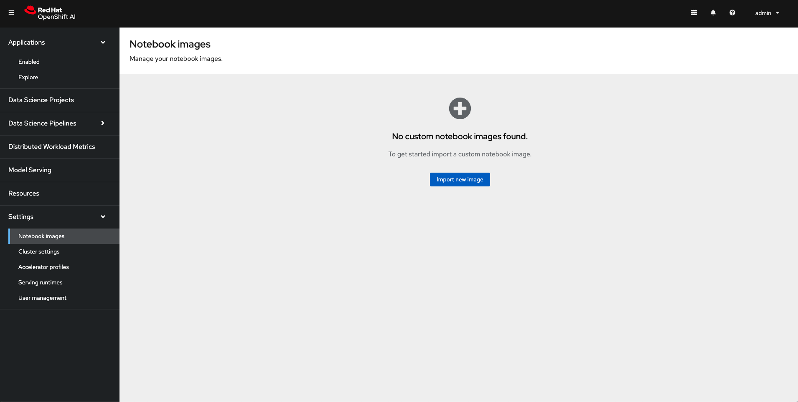
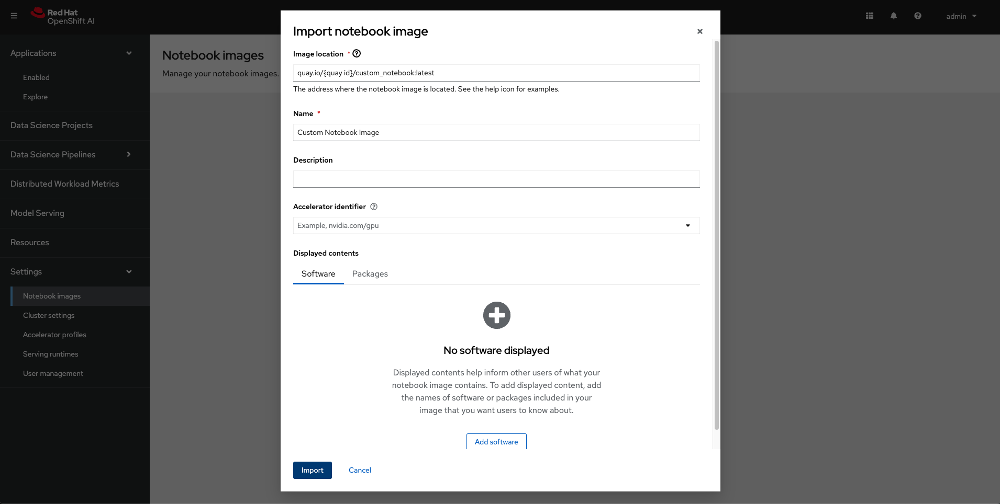
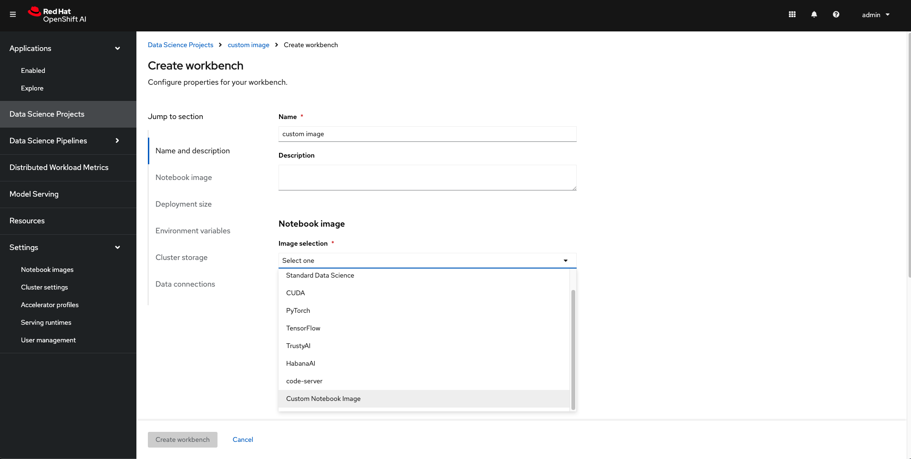

# Custom Notebook in RHOAI

## Need for custom notebooks

RHOAI provides many inbuilt notebooks like Standard Data Science notebook, Tensorflow notebook, Pytorch notebook etc. Data scientists can just spin up these notebooks and start runnings their experiments and creating their machine learning models.

These inbuilt notebooks come with most of the packages that one would need to run their Data Science projects. But the world of Data Science and Machine Learning is vast and there might be a need to download other python packages.

In this case the user can use the pip install command inside the notebook but this might lead to issues like kernel mismatches or limited visibility and control.

The best and recommended solution in this case is to create a custom notebook in RHOAI. RHOAI has made it extremely easy to import a notebook image form any image registry.

## Steps to create a custom notebook

* Install Podman and log into quay.io

* Clone the bootcamp git repository with the following command:
[source,terminal]
----
git clone https://github.com/redhat-ai-services/ai-accelerator-bootcamp.git
----

* Navigate to the custom notebook code in the cloned folder using the following command:
[source,terminal]
----
cd ai-accelerator-bootcamp/source_code/04_custom_notebook
----

* Run the podman build command to build the image and use the -t flag to tag it with your quay id. Replace {quay id} with your quay id
[source,terminal]
----
podman build -t quay.io/{quay id}/custom_notebook .
----
NOTE: if using an M-powered Mac, build with `podman build -t quay.io/{quay id}/custom_notebook . --platform linux/amd64``

* After the image is built successfully, push it to your quay repository. Replace {quay id} with your quay id
[source,terminal]
----
podman push quay.io/{quay id}/custom_notebook
----

* A new repository named custom_notebook will get created in your quay.io account. This will get created as a Private repository. Convert it into a public repository.

* Log in into RHOAI and navigate to Settings -> Notebook images

* Import a new image with the following details. Replace {quay id} with your quay id

* After the image is imported successfully, it will appear in the list of notebooks available while launching a workbench

