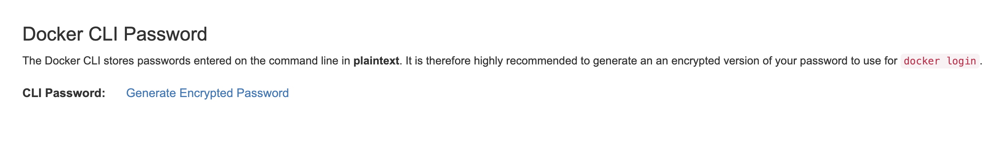
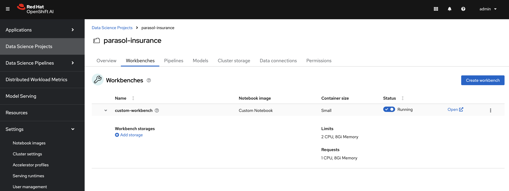

# Custom Notebook in RHOAI

## Need for custom notebooks

RHOAI provides many pre-built notebooks like Standard Data Science notebook, Tensorflow notebook, Pytorch notebook etc. Data scientists can spin up these notebooks and start running their experiments and creating their machine learning models without much set up.

These inbuilt notebooks come with most of the packages that one would need to run their Data Science projects. But the world of Data Science and Machine Learning is vast and there might be a need to download other python packages.

In this case the user can use the `pip install` command inside the notebook but this might lead to issues like kernel mismatches or limited visibility and control.

The best and recommended solution in this case is to create a custom notebook. RHOAI has made it extremely easy to import a notebook image form any image registry.

## Steps to create a custom notebook

. Install Podman and log into https://quay.io[quay.io]

+
.If you get an error saying your account is already associated with an existing Quay account.
[%collapsible]
====
If you get this error: 

_The e-mail address your-username@redhat.com is already associated with an existing Quay account. Please log in with your username and password and associate your Red Hat account to use it in the future._

The error message you see can be remedied by the following steps:

* Please go to https://recovery.quay.io/signin[https://recovery.quay.io/signin/] and sign in with your existing Quay.io email address and password.
* Once in, open account settings, click on "External logins" on the left side, and then on the "Attach" link.
* Go to quay.io/signin and enter your RHCP data and you should be set, RHSSO button should work now. If needed try to Detach and reattach when in recovery mode.
All accounts in Quay must have unique e-mail addresses and usernames. The issue here is that there exists a user under e-mail (your email address) in Quay's db. Logging in with a user with the same e-mail address will not work because users are not connected via a special table in Quay's db and Quay will perceive logging in via that button as though a new user is coming in. Quay will then check if the e-mail address is unique and will find that it's not and will error out.
====

. Clone the bootcamp git repository with the following command:

+
[source,terminal]
----
git clone https://github.com/redhat-ai-services/ai-accelerator-bootcamp.git
----

. Navigate to the custom notebook code in the cloned folder using the following command:

+
[source,terminal]
----
cd ai-accelerator-bootcamp/source_code/31_custom_notebook
----

. Run the podman build command to build the image and use the -t flag to tag it with your quay id. Replace {quay id} with your quay id

+
[source,terminal]
----
podman build -t quay.io/{quay id}/custom_notebook .
----

+
WARNING: if using an M-powered Mac, build with `podman build -t quay.io/{quay id}/custom_notebook . --platform linux/amd64`

. After the image is built successfully, push it to your quay repository. Before pushing, log into quay.io:

+
[source,terminal]
----
podman login quay.io
----

+
.Generate quay.io cli password from settings
[%collapsible]
====
Log into https://quay.io[quay.io] and go to _**Account Settings**_ in the top right. In the Account settings, _**Generate Encrypted Password**_ in order for you to login using the command line. Use this when logging into quay.io from podman

====

. Push the image to your quay repository:
Replace {quay id} with your quay id

+
[source,terminal]
----
podman push quay.io/{quay id}/custom_notebook
----

. A new repository named custom_notebook will get created in your quay.io account. This will get created as a Private repository. Convert it into a public repository.

. In the `parasol-insurance` tenant (`ai-accelerator/tenants/parasol-insurance`), create a directory named `custom-workbench`

. Create the `base` and `overlays` directories inside the `custom-workbench` directory

. Create a file named `kustomization.yaml` inside the `custom-workbench/base` directory with the following content:

+
.kustomization.yaml
[source,yaml]
----
apiVersion: kustomize.config.k8s.io/v1beta1
kind: Kustomization

resources:
  - custom-workbench-is.yaml
  - custom-workbench-pvc.yaml
  - custom-workbench-notebook.yaml
----

. Create a file named `custom-workbench-is.yaml` inside the `custom-workbench/base` directory with the following content:

+
.custom-workbench-is.yaml
[source,yaml]
----
kind: ImageStream
apiVersion: image.openshift.io/v1
metadata:
  annotations:
    opendatahub.io/notebook-image-creator: admin
    opendatahub.io/notebook-image-desc: This is a custom notebook for running the parasol insurance code
    opendatahub.io/notebook-image-name: Custom Notebook
    opendatahub.io/notebook-image-url: 'quay.io/{quay_id}/custom_notebook:latest'
    opendatahub.io/recommended-accelerators: '[]'
  name: custom-notebook
  namespace: redhat-ods-applications
  labels:
    app.kubernetes.io/created-by: byon
    opendatahub.io/dashboard: 'true'
    opendatahub.io/notebook-image: 'true'
spec:
  lookupPolicy:
    local: true
  tags:
    - name: latest
      annotations:
        opendatahub.io/notebook-python-dependencies: '[]'
        opendatahub.io/notebook-software: '[]'
        openshift.io/imported-from: 'quay.io/{quay_id}/custom_notebook:latest'
      from:
        kind: DockerImage
        name: 'quay.io/{quay_id}/custom_notebook:latest'
      importPolicy:
        importMode: Legacy
      referencePolicy:
        type: Source
----

+
[IMPORTANT]
====
Replace {quay_id} with your quay id. This ensures that the image stream you are creating references to the image you pushed to quay.io
====

. Create a file named `custom-workbench-pvc.yaml` inside the `custom-workbench/base` directory with the following content:

+
.custom-workbench-pvc.yaml
[source,yaml]
----
kind: PersistentVolumeClaim
apiVersion: v1
metadata:
  name: custom-workbench
  namespace: parasol-insurance
spec:
  accessModes:
    - ReadWriteOnce
  resources:
    requests:
      storage: 40Gi
  volumeMode: Filesystem

----

. Create a file named `custom-workbench-notebook.yaml` inside the `custom-workbench/base` directory with the following content:

+
.custom-workbench-notebook.yaml
[source,yaml]
----
apiVersion: kubeflow.org/v1
kind: Notebook
metadata:
  annotations:
    notebooks.opendatahub.io/inject-oauth: 'true'
    opendatahub.io/image-display-name: Minimal Python
    notebooks.opendatahub.io/oauth-logout-url: ''
    opendatahub.io/accelerator-name: ''
    openshift.io/description: ''
    openshift.io/display-name: custom-workbench
    notebooks.opendatahub.io/last-image-selection: 'custom-notebook:latest'
  name: custom-workbench
  namespace: parasol-insurance
spec:
  template:
    spec:
      affinity: {}
      containers:
        - name: custom-workbench
          image: 'image-registry.openshift-image-registry.svc:5000/redhat-ods-applications/custom-notebook:latest'
          resources:
            limits:
              cpu: '2'
              memory: 8Gi
            requests:
              cpu: '1'
              memory: 8Gi
          readinessProbe:
            failureThreshold: 3
            httpGet:
              path: /notebook/parasol-insurance/custom-workbench/api
              port: notebook-port
              scheme: HTTP
            initialDelaySeconds: 10
            periodSeconds: 5
            successThreshold: 1
            timeoutSeconds: 1
          livenessProbe:
            failureThreshold: 3
            httpGet:
              path: /notebook/parasol-insurance/custom-workbench/api
              port: notebook-port
              scheme: HTTP
            initialDelaySeconds: 10
            periodSeconds: 5
            successThreshold: 1
            timeoutSeconds: 1
          env:
            - name: NOTEBOOK_ARGS
              value: |-
                --ServerApp.port=8888
                --ServerApp.token=''
                --ServerApp.password=''
                --ServerApp.base_url=/notebook/parasol-insurance/custom-workbench
                --ServerApp.quit_button=False
                --ServerApp.tornado_settings={"user":"user1","hub_host":"","hub_prefix":"/projects/parasol-insurance"}
            - name: JUPYTER_IMAGE
              value: 'image-registry.openshift-image-registry.svc:5000/redhat-ods-applications/custom-notebook:latest'
            - name: PIP_CERT
              value: /etc/pki/tls/custom-certs/ca-bundle.crt
            - name: REQUESTS_CA_BUNDLE
              value: /etc/pki/tls/custom-certs/ca-bundle.crt
            - name: SSL_CERT_FILE
              value: /etc/pki/tls/custom-certs/ca-bundle.crt
            - name: PIPELINES_SSL_SA_CERTS
              value: /etc/pki/tls/custom-certs/ca-bundle.crt
          ports:
            - containerPort: 8888
              name: notebook-port
              protocol: TCP
          imagePullPolicy: Always
          volumeMounts:
            - mountPath: /opt/app-root/src
              name: custom-workbench
            - mountPath: /dev/shm
              name: shm
            - mountPath: /etc/pki/tls/custom-certs/ca-bundle.crt
              name: trusted-ca
              readOnly: true
              subPath: ca-bundle.crt
          workingDir: /opt/app-root/src
      enableServiceLinks: false
      serviceAccountName: custom-workbench
      volumes:
        - name: custom-workbench
          persistentVolumeClaim:
            claimName: custom-workbench
        - emptyDir:
            medium: Memory
          name: shm
        - configMap:
            items:
              - key: ca-bundle.crt
                path: ca-bundle.crt
            name: workbench-trusted-ca-bundle
            optional: true
          name: trusted-ca
----

. Create a directory named `parasol-insurance-dev` under the `custom-workbench/overlays` directory

. Create a file named `kustomization.yaml` inside the `custom-workbench/overlays/parasol-insurance-dev` directory with the following content:

+
.kustomization.yaml
[source,yaml]
----
apiVersion: kustomize.config.k8s.io/v1beta1
kind: Kustomization

resources:
  - ../../base
----

. Push the changes to the git repository

. Navigate to the `parasol-insurance` data science project in RHOAI, and notice the `custom-workbench` notebook available in the *Workbenches* tab:

+

[TIP]
====
Verify your work against https://github.com/redhat-ai-services/ai-accelerator-qa/pull/new/31_custom_notebook:[This custom-workbench branch]
====
