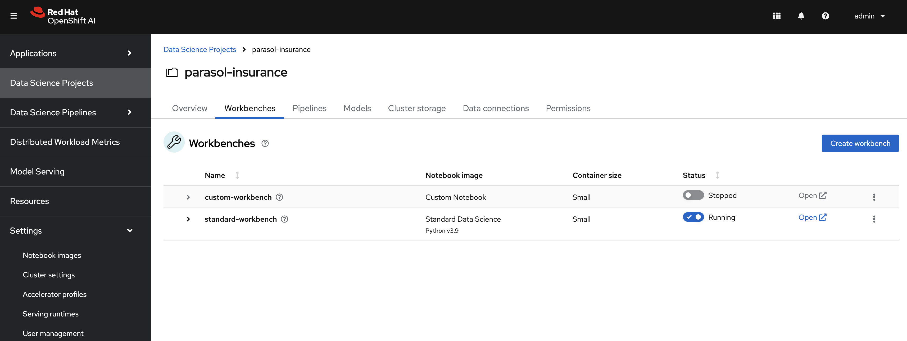

# Boto3 exploration

In this module you will use boto3 to explore the existing minio configuration and set up scripts to automate uploading the models to the locations you need for your pipelines to run. 

## Minio S3 Storage
The minio resources should be created for you by the tenant ApplicationSet when we installed GitOps and ran the bootstrap script. 

### Set up minio

. Create a `object-datastore.yaml` file in the `tenants/parasol-insurance/namespaces/base` directory with the following content:

+
.object-datastore.yaml
[source,yaml]
----
apiVersion: v1
kind: Namespace
metadata:
  name: object-datastore
  labels:
    kubernetes.io/metadata.name: object-datastore
----

. Modify the `tenants/parasol-insurance/namespaces/base/kustomization.yaml` file to include the new namespace:

+
.kustomization.yaml
[source,yaml]
----
apiVersion: kustomize.config.k8s.io/v1beta1
kind: Kustomization

resources:
  - parasol-insurance.yaml
  - object-datastore.yaml
----

. Create a new directory named `minio` in the `tenants/parasol-insurance` directory.

. Create the `base` and `overlays` directories inside the `minio` directory.

. Create a file named `kustomization.yaml` inside the `minio/base` directory with the following content:

+
.kustomization.yaml
[source,yaml]
----
apiVersion: kustomize.config.k8s.io/v1beta1
kind: Kustomization

namespace: object-datastore

resources:
  - ../../../../components/apps/minio/overlays/default
----

. Add the overlay for `parasol-insurance-dev`, and `parasol-insurance-prod` with the following `kustomization.yaml` file content:

+
.kustomization.yaml
[source,yaml]
----
apiVersion: kustomize.config.k8s.io/v1beta1
kind: Kustomization

resources:
  - ../../base
----

+
[TIP]
====
The same content will work for both overlays (dev and prod)
====

You should find your minio resource in the _**object-datastore**_ namespace.

The *minio-ui* route can be found in _**object-datastore**_ namespace under _**Routes**_. Open this in a new tab and log in with `minio:minio123`.

Explore the S3 storage.

## Set up an standard data science workbench to explore S3 with boto3

We have previously used a custom workbench to explore how to train a model. Now we will use a standard workbench to explore the S3 storage.

### Create a standard workbench

. Navigate to RHOAI dashboard, and stop the `custom-workbench`.

. Create a directory named `standard-workbench` in the `tenants/parasol-insurance` directory.

. Create the `base` and `overlays` directories inside the `standard-workbench` directory.

. Create a file named `kustomization.yaml` inside the `standard-workbench/base` directory with the following content:

+
.kustomization.yaml
[source,yaml]
----
apiVersion: kustomize.config.k8s.io/v1beta1
kind: Kustomization

resources:
  - standard-workbench-pvc.yaml
  - standard-workbench-notebook.yaml
----

. Create a file named `standard-workbench-pvc.yaml` inside the `standard-workbench/base` directory with the following content:

+
.standard-workbench-pvc.yaml
[source,yaml]
----
kind: PersistentVolumeClaim
apiVersion: v1
metadata:
  name: standard-workbench
  namespace: parasol-insurance
spec:
  accessModes:
    - ReadWriteOnce
  resources:
    requests:
      storage: 40Gi
  volumeMode: Filesystem
----

. Create a file named `standard-workbench-notebook.yaml` inside the `standard-workbench/base` directory with the following content:

+
.standard-workbench-notebook.yaml
[source,yaml]
----
apiVersion: kubeflow.org/v1
kind: Notebook
metadata:
  annotations:
    notebooks.opendatahub.io/inject-oauth: 'true'
    opendatahub.io/image-display-name: Standard Data Science
    notebooks.opendatahub.io/oauth-logout-url: ''
    opendatahub.io/accelerator-name: ''
    openshift.io/description: ''
    openshift.io/display-name: standard-workbench
    notebooks.opendatahub.io/last-image-selection: 's2i-generic-data-science-notebook:2024.1'
  name: standard-workbench
  namespace: parasol-insurance
spec:
  template:
    spec:
      affinity: {}
      containers:
        - name: standard-workbench
          image: 'image-registry.openshift-image-registry.svc:5000/redhat-ods-applications/s2i-generic-data-science-notebook:2024.1'
          resources:
            limits:
              cpu: '2'
              memory: 8Gi
            requests:
              cpu: '1'
              memory: 8Gi
          readinessProbe:
            failureThreshold: 3
            httpGet:
              path: /notebook/parasol-insurance/standard-workbench/api
              port: notebook-port
              scheme: HTTP
            initialDelaySeconds: 10
            periodSeconds: 5
            successThreshold: 1
            timeoutSeconds: 1
          livenessProbe:
            failureThreshold: 3
            httpGet:
              path: /notebook/parasol-insurance/standard-workbench/api
              port: notebook-port
              scheme: HTTP
            initialDelaySeconds: 10
            periodSeconds: 5
            successThreshold: 1
            timeoutSeconds: 1
          env:
            - name: NOTEBOOK_ARGS
              value: |-
                --ServerApp.port=8888
                --ServerApp.token=''
                --ServerApp.password=''
                --ServerApp.base_url=/notebook/parasol-insurance/standard-workbench
                --ServerApp.quit_button=False
                --ServerApp.tornado_settings={"user":"user1","hub_host":"","hub_prefix":"/projects/parasol-insurance"}
            - name: JUPYTER_IMAGE
              value: 'image-registry.openshift-image-registry.svc:5000/redhat-ods-applications/s2i-generic-data-science-notebook:2024.1'
            - name: PIP_CERT
              value: /etc/pki/tls/custom-certs/ca-bundle.crt
            - name: REQUESTS_CA_BUNDLE
              value: /etc/pki/tls/custom-certs/ca-bundle.crt
            - name: SSL_CERT_FILE
              value: /etc/pki/tls/custom-certs/ca-bundle.crt
            - name: PIPELINES_SSL_SA_CERTS
              value: /etc/pki/tls/custom-certs/ca-bundle.crt
          ports:
            - containerPort: 8888
              name: notebook-port
              protocol: TCP
          imagePullPolicy: Always
          volumeMounts:
            - mountPath: /opt/app-root/src
              name: standard-workbench
            - mountPath: /dev/shm
              name: shm
            - mountPath: /etc/pki/tls/custom-certs/ca-bundle.crt
              name: trusted-ca
              readOnly: true
              subPath: ca-bundle.crt
          workingDir: /opt/app-root/src
      enableServiceLinks: false
      serviceAccountName: standard-workbench
      volumes:
        - name: standard-workbench
          persistentVolumeClaim:
            claimName: standard-workbench
        - emptyDir:
            medium: Memory
          name: shm
        - configMap:
            items:
              - key: ca-bundle.crt
                path: ca-bundle.crt
            name: workbench-trusted-ca-bundle
            optional: true
          name: trusted-ca
----

. Create a directory named `parasol-insurance-dev` under the `standard-workbench/overlays` directory.

. Create a file named `kustomization.yaml` inside the `standard-workbench/overlays/parasol-insurance-dev` directory with the following content:

+
.kustomization.yaml
[source,yaml]
----
apiVersion: kustomize.config.k8s.io/v1beta1
kind: Kustomization

resources:
  - ../../base
----

. Push the changes to git, and wait for the synchrnization to complete.

. Navigate to RHOAI dashboard, and you should see an `Standard Workbench` available in the `Workbenches` tab.

+

## Explore S3 in RHOAI Workbench:
Some S3 technologies do not come with UI or CLI to interact with the buckets or files. A common tool that can be used accross all S3 technologies is boto3. Boto3 is the AWS SDK for Python. It allows you to directly interact with AWS services such as S3, EC2, and more.

. Go to RHOAI Dashboard and go to the _**parasol-insurance**_ Data Science Project.

+

. As you can see there is a workbench running named _standard-workbench_. 

. Launch the workbench and wait for the Jupyter notebook to spin up.

. Create a new Notebook. 

. In a new cell, add and run the content below to install boto3 so we can use it.

+
[source, python]
----
!pip install boto3
----

. In a new cell, add the content below. Change the minio_url to your cluster's _**minio-api**_ url. Use the function to view the buckets and content of the bucket in the minio storage.

[source, python]
----
#!/usr/bin/env python
# coding: utf-8

# Boto3 interactive exploration
import boto3
from botocore.client import Config

# Configuration
minio_url = "https://minio-api-ai-example-training.apps.cluster-CHANGEME.dynamic.redhatworkshops.io"
access_key = "minio"
secret_key = "minio123"

# Setting up the MinIO client
s3 = boto3.client(
    's3',
    endpoint_url=minio_url,
    aws_access_key_id=access_key,
    aws_secret_access_key=secret_key,
    config=Config(signature_version='s3v4'),
)

# Function to get MinIO server info
def get_minio_buckets():
    # This function retrieves the list of buckets as an example.
    # MinIO admin info is not directly supported by boto3; you'd need to use MinIO's admin API.
    response = s3.list_buckets()
    print("Buckets:")
    for bucket in response['Buckets']:
        print(f'  {bucket["Name"]}')

def get_minio_content(bucket):
    # This function retrieves the content in the bucket
    # MinIO admin info is not directly supported by boto3; you'd need to use MinIO's admin API.
    print("Content:")
    for key in s3.list_objects(Bucket=bucket)['Contents']:
        print(f'  {key["Key"]}')
       
# Setting alias (not applicable in Boto3, but setup is similar to configuring the client)
print("MinIO client configured successfully.")

# Getting MinIO server info
get_minio_buckets()
get_minio_content('your_bucket_name')
----

You should see the contents of the S3 buckets:

+
image::images/Boto3_view_content.png[]

. Create a script to upload the model to your s3 pipeline bucket

+
[source,python]
----
#!/usr/bin/env python
# coding: utf-8

import boto3
from botocore.client import Config

# Configuration
minio_url = "https://minio-api-ai-example-training.apps.cluster-CHANGEME.dynamic.redhatworkshops.io"
access_key = "minio"
secret_key = "minio123"
bucket_name = "pipelines"
file_path = "accident_detect.onnx"
object_name = "accident_model/accident_detect.onnx"  # You can change this if you want with a different object name and a folder name

# Setting up the MinIO client
s3 = boto3.client(
    's3',
    endpoint_url=minio_url,
    aws_access_key_id=access_key,
    aws_secret_access_key=secret_key,
    config=Config(signature_version='s3v4'),
)

# Function to upload a file to a bucket
def upload_file(file_path, bucket_name, object_name):
    try:
        s3.upload_file(file_path, bucket_name, object_name)
        print(f"File '{file_path}' successfully uploaded to bucket '{bucket_name}' as '{object_name}'.")
    except Exception as e:
        print(f"Error uploading file '{file_path}' to bucket '{bucket_name}': {e}")

# Upload the file
upload_file(file_path, bucket_name, object_name)
----

. View the contents of your S3 bucket and make sure the file has been uploaded.

