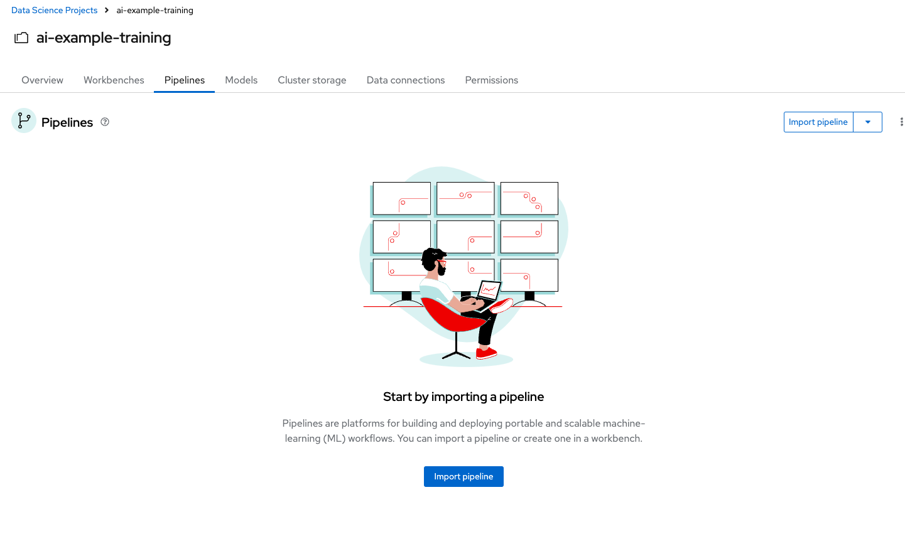
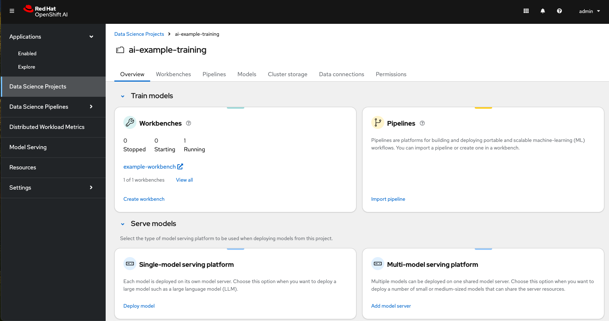
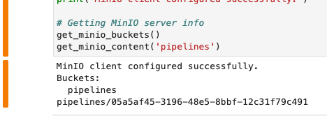

# Boto3 exploration

In this module you will use boto3 to explore the existing minio configuration and set up scripts to automate uploading the models to the locations you need for your pipelines to run. 

## Minio S3 Storage
The minio resources should be created for you by the tenant ApplicationSet when we installed GitOps and ran the bootstrap script. 

._Set up minio manually (if needed)_
[%collapsible]
====
 1. Create `minio` namespace or use whatever namespace you would like
 2. Change to new namespace and change to new namespace.
 3. Apply the _**pvc.yaml**_, _**secret.yaml**_, _**service.yaml**_, _**routes.yaml**_, and _**deployment.yaml**_ from the https://github.com/redhat-ai-services/ai-accelerator/tree/main/components/apps/minio/base[ai-accelerator project].
    This will create the PVC, admin password secret, deployment, service, api route, and UI route.
 4. The credentials to log into minio are from the secret `minio-secret` from the secret.yaml to login. `minio:minio123`
====
[%collapsible]

You should find your minio resource in the _**ai-example-training**_ namespace.

The *minio-ui* route can be found in _**ai-example-training**_ namespace under _**Routes**_. Open this in a new tab and log in with `minio:minio123`.

Explore the S3 storage.
Create buckets and add a files and folder to it.

._Bonus: Use a pipeline to add files to S3_
[%collapsible]
====
1. In the _ai-example-training_ namespace, a Pipeline Server has already been configured. You can view the yaml of the pipeline server here: https://github.com/redhat-ai-services/ai-accelerator/blob/main/tenants/ai-example/datascience-pipelines/base/dspa.yaml[ai-accelerator_dspa.yaml]
2. Under the _Pipeline_ tab, import a pipeline

[start=3]
3. Use this example pipeline: https://raw.githubusercontent.com/redhat-ai-services/ai-accelerator-bootcamp/main/source_code/34_boto3/compiled_pipeline.yaml[compiled_pipeline.yaml] (Download the file or use it in the _Import by url_)

[start=4]
4. After the pipeline has been imported, create a run.

5. The pipeline will now run. You can go into OpenShift Dashboard>Pipelines>Pipeline Runs to see more details about the pipeline run.

6. After the pipeline run has ran successfully, check S3 and there should be a bucket named _**pipelines**_ with the results of the pipeline run.

====
[%collapsible]

## Explore S3 in RHOAI Workbench:
Sometimes you won't have access to a customer's S3 storage UI or CLI. If that is the case, we can explore an S3 storage using a workbench and python code.

1. Go to RHOAI Dashboard and go to the _**ai-example-training**_ Data Science Project.

[start=2]
2. As you can see there is a workbench running named _example-workbench_. 

3. Launch the workbench and wait for the Jupyter notebook to spin up.

4. Create a new Notebook. 

5. In a new cell, add and run the content below to install boto3 so we can use it.

[source, python]
----
!pip install boto3
----

[start=6]
6. In a new cell, add the content below. Change the minio_url to your cluster's _**minio-api**_ url. Use the function to view the buckets and content of the bucket in the minio storage.

[source, python]
----
#!/usr/bin/env python
# coding: utf-8

# Boto3 interactive exploration
import boto3
from botocore.client import Config

# Configuration
minio_url = "https://minio-api-ai-example-training.apps.cluster-CHANGEME.dynamic.redhatworkshops.io"
access_key = "minio"
secret_key = "minio123"

# Setting up the MinIO client
s3 = boto3.client(
    's3',
    endpoint_url=minio_url,
    aws_access_key_id=access_key,
    aws_secret_access_key=secret_key,
    config=Config(signature_version='s3v4'),
)

# Function to get MinIO server info
def get_minio_buckets():
    # This function retrieves the list of buckets as an example.
    # MinIO admin info is not directly supported by boto3; you'd need to use MinIO's admin API.
    response = s3.list_buckets()
    print("Buckets:")
    for bucket in response['Buckets']:
        print(f'  {bucket["Name"]}')

def get_minio_content(bucket):
    # This function retrieves the content in the bucket
    # MinIO admin info is not directly supported by boto3; you'd need to use MinIO's admin API.
    print("Content:")
    for key in s3.list_objects(Bucket=bucket)['Contents']:
        print(f'  {key["Key"]}')
       
# Setting alias (not applicable in Boto3, but setup is similar to configuring the client)
print("MinIO client configured successfully.")

# Getting MinIO server info
get_minio_buckets()
get_minio_content('your_bucket_name')
----

You should see the contents of the S3 buckets:

[start=7]
7. Create a script to upload the model to your s3 pipeline bucket

[source,python]
----
#!/usr/bin/env python
# coding: utf-8

import boto3
from botocore.client import Config

# Configuration
minio_url = "https://minio-api-ai-example-training.apps.cluster-CHANGEME.dynamic.redhatworkshops.io"
access_key = "minio"
secret_key = "minio123"
bucket_name = "pipelines"
file_path = "accident_detect.onnx"
object_name = "accident_model/accident_detect.onnx"  # You can change this if you want with a different object name and a folder name

# Setting up the MinIO client
s3 = boto3.client(
    's3',
    endpoint_url=minio_url,
    aws_access_key_id=access_key,
    aws_secret_access_key=secret_key,
    config=Config(signature_version='s3v4'),
)

# Function to upload a file to a bucket
def upload_file(file_path, bucket_name, object_name):
    try:
        s3.upload_file(file_path, bucket_name, object_name)
        print(f"File '{file_path}' successfully uploaded to bucket '{bucket_name}' as '{object_name}'.")
    except Exception as e:
        print(f"Error uploading file '{file_path}' to bucket '{bucket_name}': {e}")

# Upload the file
upload_file(file_path, bucket_name, object_name)
----

[start=8]
8. View the contents of your S3 bucket and make sure the file has been uploaded.

