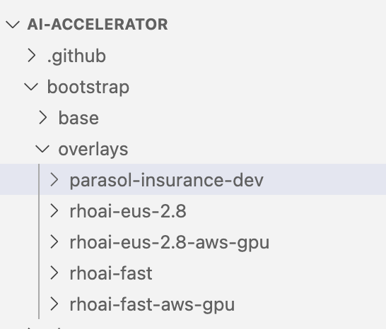

# Environment Install and Setup: DEV and PROD Cluster

## parasol-insurance-dev cluster
Follow the following steps to complete the install and setup:

* After the cluster is running and ready, log in as the admin

* Copy the login token as shown in the image. Paste it in the terminal and run it. This should log you into the cluster through the terminal.

image::images/Login_command.png[Copy the login token]

[NOTE]
====
If you have certificate errors to login to the cluster, remember to use `--insecure-skip-tls-verify=true` in the login command.
====

## Setting up ai-accelerator project for Dev cluster
.Instructions to fork ai-accelerator
[%collapsible]
====
* Log into your git account and fork the following repository:
----
https://github.com/redhat-ai-services/ai-accelerator.git
----

* Once forked, clone the repository to your local machine.
[source,terminal]
----
git clone https://github.com/{Git_ID}/ai-accelerator.git
----

* Navigate to the cloned folder with the command:
[source,terminal]
----
cd ai-accelerator/
----
[%collapsible]
====

The ai-accelerator project uses Kustomize and GitOps/ArgoCD to deploy our project. It uses the `bootstrap.sh` script to deploy GitOps on the cluster. After GitOps is installed onto the cluster, it will then apply an overlay.

The overlay determines which folder/versions to apply to the cluster. This allows you to reuse components and files across multiple instances with different setups.

In our case, we want to set up a _parasol-insurance-dev_ overlay.

. Open the the redhat-ai-services/ai-accelerator fork that was cloned earlier in your code editor.

. Open `bootstrap/overlays` and create a new folder under the `overlays` folder named `parasol-insurance-dev`.

+

. In the `bootstrap/overlays/parasol-insurance-dev` folder, create a new file named `kustomization.yaml` add the below to the file.

+
.kustomization.yaml
[source,yaml]
----
apiVersion: kustomize.config.k8s.io/v1beta1
kind: Kustomization

resources:
- ../../base
- ../../../clusters/overlays/parasol-insurance-dev
----

+
[IMPORTANT]
As you can see, the Kustomization resource from above is referencing the `clusters/overlays/parasol-insurance-dev` folder. Let's create that folder

. In the `clusters/overlays/parasol-insurance-dev` folder, create a new file named `kustomization.yaml` add the below content to the file:

+
.kustomization.yaml
[source,yaml]
----
apiVersion: kustomize.config.k8s.io/v1beta1
kind: Kustomization

namespace: openshift-gitops

resources:
  - ../../base
  - ../../../components/argocd/apps/overlays/parasol-insurance-dev

patches:
  # set the repo and branch for applications
  - path: patch-application-repo-revision.yaml
    target:
      group: argoproj.io
      kind: Application

replacements:
  - source:
      kind: Application
      fieldPath: spec.source.repoURL
    targets:
      - select:
          kind: ApplicationSet
        fieldPaths:
          - spec.template.spec.source.repoURL
      - select:
          kind: ApplicationSet
          name: tenants
        fieldPaths:
          - spec.generators.*.git.repoURL
  - source:
      kind: Application
      fieldPath: spec.source.targetRevision
    targets:
      - select:
          kind: ApplicationSet
        fieldPaths:
          - spec.template.spec.source.targetRevision
      - select:
          kind: ApplicationSet
          name: tenants
        fieldPaths:
          - spec.generators.*.git.revision
----

. In the `clusters/overlays/parasol-insurance-dev` folder, create a new file named `patchpatch-applicationset-manual-sync.yaml` add the below content to the file:

+
.patchpatch-applicationset-manual-sync.yaml
[source,yaml]
----
- op: remove
  path: /spec/template/spec/syncPolicy
----

. In the `clusters/overlays/parasol-insurance-dev`, create a new file named `patch-application-manual-sync.yaml` add the below content to the file:

+
.patch-application-manual-sync.yaml
[source,yaml]
----
- op: remove
  path: /spec/syncPolicy
----

. In the `clusters/overlays/parasol-insurance-dev` folder, create a new file named `patch-application-repo-revision.yaml` add the below content to the file.
Replace the repoURL with your fork URL.

+
.patch-application-repo-revision.yaml
[source,yaml]
----
- op: replace
  path: /spec/source/repoURL
  value: 'https://github.com/JeetRH/ai-accelerator.git'
- op: replace
  path: /spec/source/targetRevision
  value: main
----

. The folder structure should look like this:

+
image::images/GitOpsFolderStructure1.png[width=20%]

. In the `tenants` folder, create a new folder named `dev`.
Here is where we'll be adding our new resources.

+
NOTE: Remember to add the base and overlays files and folders. Make sure you have the `parasol-insurance-dev` overlay in the `overlays` folder for Argo to pick up what it needs for the DEV environment.

. Run the bootstrap script by running the bootstrap.sh script
[source,terminal]
----
./bootstrap.sh
----

* This will first install the GitOps Operator and then provide the user with the following overlays:

+
.Please enter a number to select a bootstrap folder:
[order=arabic]
1. bootstrap/overlays/parasol-insurance-dev/
2. bootstrap/overlays/rhoai-eus-2.8-aws-gpu/
3. bootstrap/overlays/rhoai-eus-2.8/
4. bootstrap/overlays/rhoai-fast-aws-gpu/
5. bootstrap/overlays/rhoai-fast/

* For _**DEV**_ environments type the number 1 and press Enter.

## parasol-insurance-prod cluster
The steps to set up the _**parasol-insurance-prod**_ cluster are the same as _parasol_insurance_dev_, except change _dev_ to _prod_ in the kustomization files and folders.

When running the bootstrap script, select `bootstrap/overlays/parasol-insurance-prod`