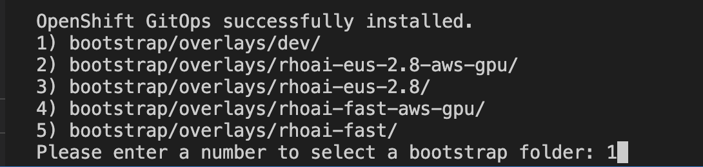

# Gitops

## Custom notebook image stream and minio

In this section we are going to create the same custom notebook that we created in the previous sections, but in a Gitops way.

To do this we are going to edit ai-accelerator code that we have forked.

The aim to is create an overlay named dev and in that, instead of creating the ai-custom-workbenches and ai-example tenants, we just create the dev tenant.

In this dev tenant we want to create an image stream for our custom notebook image. This way it shows up in our RHOAI notebook options and we can start a workbench with it.

The aim of this tutorial is to understand how we can utilize the AI Accelerator script and make edits to it based on the needs of our customers.okay

Apart from adding the custom notebook, the rest of the content should be similar to the rhoai-fast. 

Make the following changes to the existing script:

* Add a dev folder to the bootstrap -> overlays folder. This should have a kustomization.yaml file

* Add a dev folder to the clusters -> overlays folder. This should have the kustomization.yaml, patch-application-manual-sync.yaml, patch-application-repo-revision.yaml and patch-applicationset-manual-sync.yaml files

* Add your forked branch to the patch-application-repo-revision.yaml file

* Add a dev folder to the components -> argocd -> apps -> overlays folder. This should have the kustomization.yaml, patch-cluster-config-app-of-apps.yaml, patch-configs-list.yaml, patch-operators-list.yaml and patch-tenants-applicationset.yaml files

* Add a dev folder to the tenants folder. In this create a new namespace named dev with the namespaces folder and an image-stream folder to add an image stream.

* To add a minio instance we can make use of resources that are already present in the ai-accelerator script. Create another folder named minio in the tenants section. Create the base and ovelays folder structure. In the base create the following kustomization file
[source,python]
----
apiVersion: kustomize.config.k8s.io/v1beta1
kind: Kustomization

namespace: dev

resources:
  - ../../../../components/apps/minio/overlays/default
----

* Now run the ./bootstrap.sh script on a new cluster. This time select the dev option as follows

* After everything is set up,  