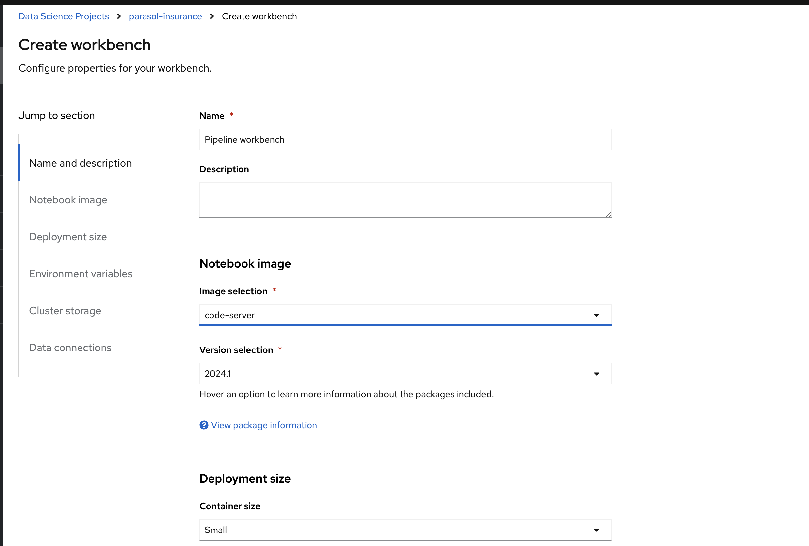
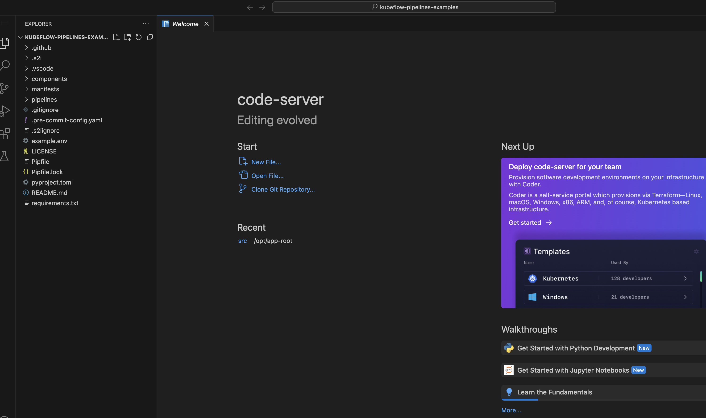
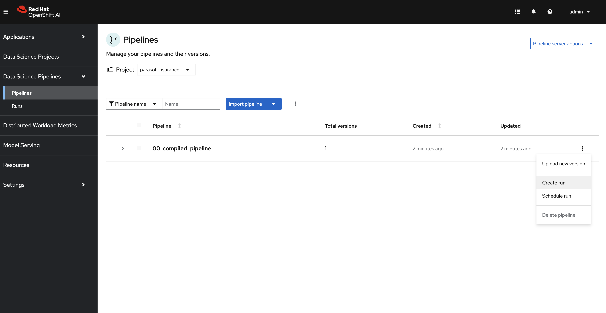

# Introduction to Kubeflow Pipelines

In this module we will learn about how kubeflow pipelines are defined and how they can be run in Openshift AI with some examples.

## Setup

To setup the environment for this, please follow the following steps:

. In RHOAI and in the `parasol-insurance` project, create a workbench named `Pipeline workbench` and use the `code-server` image. Keep the other default options and click on Create

+

. When the workbench starts running, open it and clone the following repository: `https://github.com/redhat-ai-services/kubeflow-pipelines-examples.git`. You can keep the default path as /opt/app-root/src. Now open the folder that is cloned. Your window should look as follows:

+

. Rename the `example.env` file to `.env`

. Open the .env file. We need to change some of the values.
.. In the `DEFAULT_STORAGE_CLASS` add the default storage class in your cluster. This is `Storage -> StorageClasses`.
.. The `KUBEFLOW_ENDPOINT` value is the `ds-pipeline-dspa` route in the `parasol-insurance namespace`
.. The `BEARER_TOKEN` can be found in the `Copy login command section`

+
The env file should look as follows after all the changes are done.
[source,python]
----
DEFAULT_STORAGE_CLASS="ocs-external-storagecluster-ceph-rbd"
DEFAULT_ACCESSMODES="ReadWriteOnce"
KUBEFLOW_ENDPOINT="https://ds-pipeline-dspa-parasol-insurance.apps.cluster-vt9jb.dynamic.redhatworkshops.io"
BEARER_TOKEN="sha256~0QQ0VTC87TQf6GsOKxm6ay4-_sw8O4x7ZWvzzZVo34I~" # oc whoami --show-token
----

. Open the terminal and run the following command to install pipenv: `pip install pipenv`

. Now we can install all the packages that are defined in the Pipfile. We can do this with the command: `pipenv install`

. Now our environment is ready to run all the examples. Check if you get an output with the command: `pip list | grep kfp`

## Pipeline examples

. All the pipeline examples are in the `pipelines` folder

. Open the file `00_compiled_pipeline.py`. This is a very basic example of how to create a kfp pipeline. In this we are compiling the pipeline into a yaml file. To run the pipeline go to the terminal and execute the command: `python pipelines/00_compiled_pipeline.py`. 
.. This will generate a yaml file named '00_compiled_pipeline.yaml'
.. Download this file to your local machine
.. Now go to RHOAI and into the Data Science Pipelines section. Click on `Import pipeline` and upload the file.
.. To run this pipeline click on the Create Run option as follows:

+

.. To check the run, go to the Runs section under the Data Science Pipelines section

. Next we will check the file `01_test_connection_via_route.py`. This just checks if we can connect to kfp with the route that we entered in the .env file. To run this go to the terminal in the notebook and execute the command: `python pipelines/01_test_connection_via_route.py`

. As we saw in the first example, compiling the pipeline and importing it in RHOAI is a little tedious. The next example '02_submitted_pipeline_via_route.py' shows us how we can submit the pipeline directly from our notebook. To run this go to the terminal in the notebook and execute the command: 'python pipelines/02_submitted_pipeline_via_route.py'. This will create a pipeline and also submit a run. To view this run go to RHOAI into Data Science Pipelines and check the Runs section.

