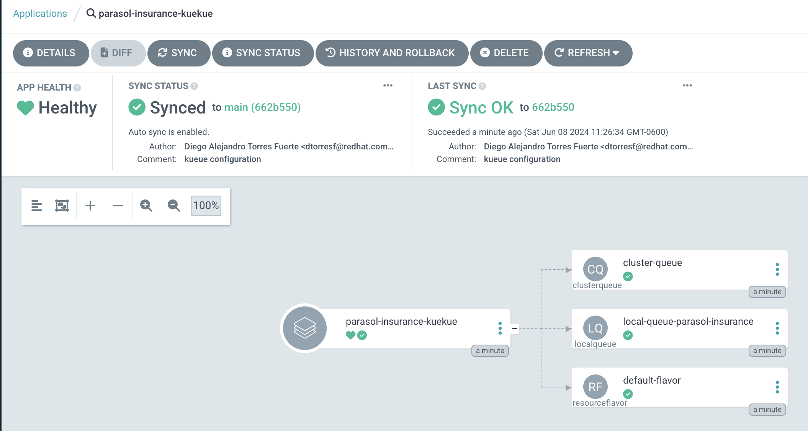
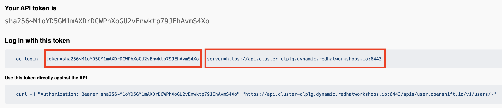
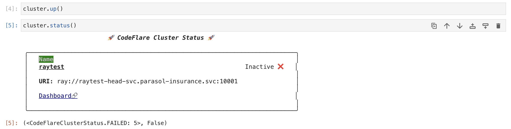
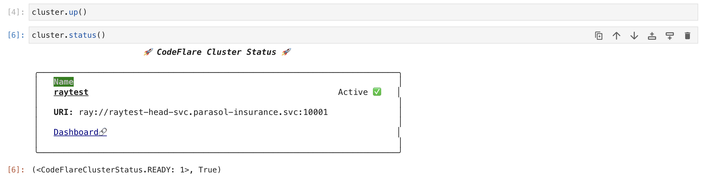
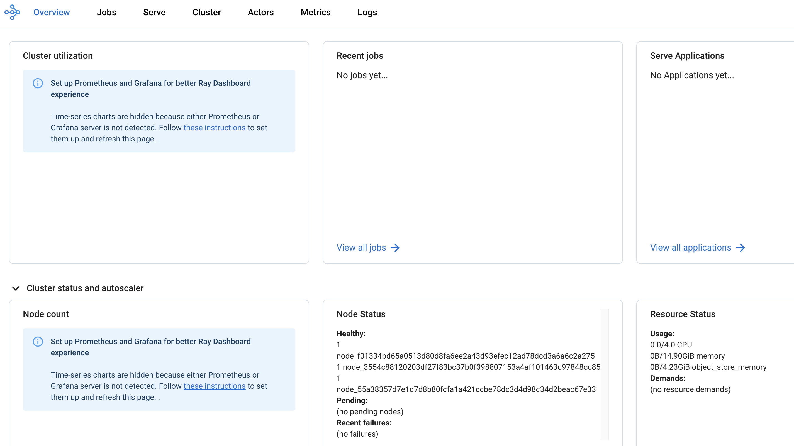
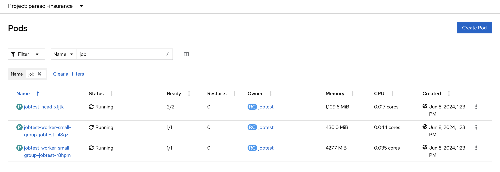
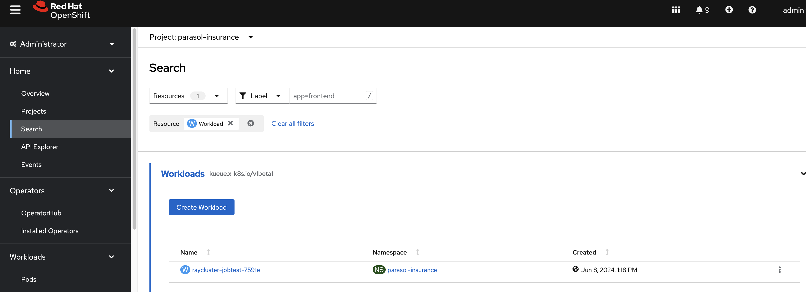
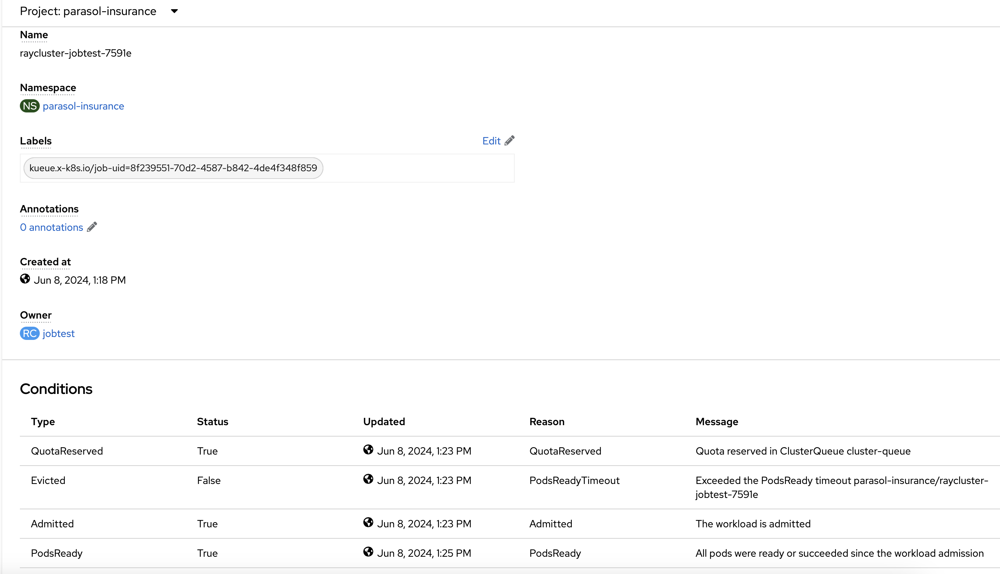
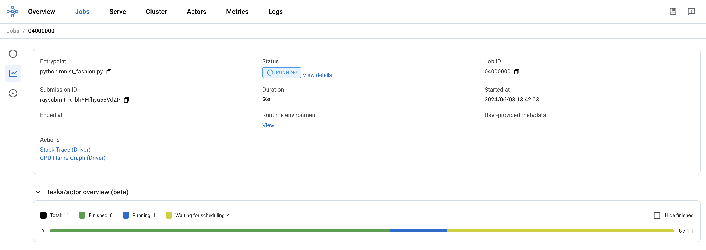

# Distributed training

In this section, we will cover how to train a model on multiple containers using the Ray Cluster capabilities of the RHOAI platform.

The official documentation on how to perform distributed training with Ray can be found here: https://access.redhat.com/documentation/en-us/red_hat_openshift_ai_self-managed/2.9/html-single/working_with_distributed_workloads/index[working with distributed workloads].

The ray cluster documentation can be found here: https://docs.ray.io/en/latest/cluster/getting-started.html[Ray Clusters Documentation].

Kueue is a kubernetes-native system that manages quotas and how jobs consume them. Kueue decides when a job should wait, when a job should be admitted to start (as in pods can be created) and when a job should be preempted (as in active pods should be deleted). Find more information about Kueue here: https://kueue.sigs.k8s.io/docs/[Kueue Documentation].

## Create the Kueue configuration with GitOps

. In the `parasol-insurance` tenant directory, create a new directory called `kueue`, and create the `base` and `overlays` directories inside it.

. In the `base` directory, create a file called `kustomization.yaml` with the following content:

+
.kueue/base/kustomization.yaml
[source, yaml]
----
apiVersion: kustomize.config.k8s.io/v1beta1
kind: Kustomization

resources:
  - cluster-queue.yaml
  - default-flavor.yaml
  - local-queue.yaml
----

. In the `base` directory, create a file called `cluster-queue.yaml` with the following content:

+
.kueue/base/cluster-queue.yaml
[source, yaml]
----
apiVersion: kueue.x-k8s.io/v1beta1
kind: ClusterQueue
metadata:
  name: "cluster-queue"
spec:
  namespaceSelector: {}  # match all.
  resourceGroups:
  - coveredResources: ["cpu", "memory", "nvidia.com/gpu"]
    flavors:
    - name: "default-flavor"
      resources:
      - name: "cpu"
        nominalQuota: 9
      - name: "memory"
        nominalQuota: 36Gi
      - name: "nvidia.com/gpu"
        nominalQuota: 0
----

. In the `base` directory, create a file called `default-flavor.yaml` with the following content:

+
.kueue/base/default-flavor.yaml
[source, yaml]
----
apiVersion: kueue.x-k8s.io/v1beta1
kind: ResourceFlavor
metadata:
  name: default-flavor
----

. In the `base` directory, create a file called `local-queue.yaml` with the following content:

+
.kueue/base/local-queue.yaml
[source, yaml]
----
apiVersion: kueue.x-k8s.io/v1beta1
kind: LocalQueue
metadata:
  namespace: parasol-insurance
  name: local-queue-parasol-insurance
  annotations:
    kueue.x-k8s.io/default-queue: 'true'
spec:
  clusterQueue: cluster-queue
----

. In the `overlays` directory, create the `parasol-insurance-dev` directory.

. In the `parasol-insurance-dev` directory, create a file called `kustomization.yaml` with the following content:

+
.kueue/overlays/parasol-insurance-dev/kustomization.yaml
[source, yaml]
----
apiVersion: kustomize.config.k8s.io/v1beta1
kind: Kustomization

resources:
  - ../../base
----

. Push your changes to the Git repository, and wait for the application to sync in ArgoCD.

+

## Running distributed workloads

### Basic Ray cluster setup

. Using the `standard-workbench` workbench, create a new Jupyter Notebook with the name `0_basic_ray.ipynb`.

. Add a cell with the imports:

+
[source,python]
----
from codeflare_sdk import Cluster, ClusterConfiguration, TokenAuthentication
from codeflare_sdk import generate_cert
----

. Add a cell to authenticate with the OpenShift cluster:

+
[source,python]
----
auth = TokenAuthentication(
    token = "sha256~M1oYD5GM1mAXDrDCWPhXoGU2vEnwktp79JEhAvmS4Xo",
    server = "https://api.cluster-clplg.dynamic.redhatworkshops.io:6443",
    skip_tls=True
)
auth.login()
----

+
[IMPORTANT]
====
Replace the `token` and `server` values with the correct values for your OpenShift cluster.

You can find these values in the OpenShift Web Console by clicking on your username in the top right corner and selecting `Copy Login Command`.

====

. Add a cell to configure a Ray cluster:

+
[source,python]
----
cluster = Cluster(ClusterConfiguration(
    name='raytest', 
    namespace='parasol-insurance', 
    head_gpus=0, # For GPU enabled workloads set the head_gpus and num_gpus
    num_gpus=0,
    num_workers=2,
    min_cpus=1,
    max_cpus=1,
    min_memory=4,
    max_memory=4,
    image="quay.io/project-codeflare/ray:latest-py39-cu118",
    write_to_file=False, # When enabled Ray Cluster yaml files are written to /HOME/.codeflare/resources 
    # local_queue="local-queue-parasol-insurance" # Specify the local queue manually
))
----

. Add a cell to start the Ray cluster:

+
[source,python]
----
cluster.up()
----

. Add a cell to check the status of the Ray cluster:

+
[source,python]
----
cluster.status()
----

+

. repeat running the `cluster.status()` cell until the status is `Active`.

+

+
[NOTE]
====
The status of the cluster will be `Inactive` until the cluster is fully up and running.

If the cluster fails to start, it may go to the `Suspended` status. In this case, you can check the logs of the cluster by running the `cluster.logs()` instruction.

The `cluster.status()` instruction is a monitoring instruction that will return the status of the cluster.

You can also use the `cluster.logs()` instruction to check the logs of the cluster.

You can use the `cluster.wait_ready()` instruction to wait until the cluster is fully up and running.
====

. Add a cell to setup the Ray cluster certificates for mutual TLS:

+
[source,python]
----
generate_cert.generate_tls_cert(cluster.config.name, cluster.config.namespace)
generate_cert.export_env(cluster.config.name, cluster.config.namespace)
----

+
[IMPORTANT]
====
The generate cert instructions only work in a Ray cluster that is up and running. If you run this cell before the cluster is ready, you will get an error.
====

+
[NOTE]
====
Mutual Transport Layer Security (mTLS) is enabled by default in the CodeFlare component in OpenShift AI. You must include the Ray cluster authentication code to enable the Ray client that runs within a notebook to connect to a secure Ray cluster that has mTLS enabled.

With mTLS mechanism, the Ray Cluster pods create certificates that are used for mutual Transport Layer Security (mTLS), a form of mutual authentication, between Ray Cluster nodes.
====

. Navigate to the Ray cluster dashboard using the link provided by the `cluster.status()` cell.

+

+
[TIP]
====
Find more information about the cluster dashboard here: https://docs.ray.io/en/latest/ray-observability/getting-started.html[Ray Cluster Dashboard].
====

. Add a cell to stop the Ray cluster:

+
[source,python]
----
cluster.down()
----

. Notice that the Ray cluster will be stopped, and the status will be `Inactive`. Also, the Ray cluster dashboard will be unavailable.

. Add a cell to log out of the OpenShift cluster:

+
[source,python]
----
auth.logout()
----

. Save and close the notebook.

### Running a distributed workload

. Using the `standard-workbench` workbench, create a new python script file with the name `mnist_fashion.py`.

. Add the following code to the `mnist_fashion.py` file:

+
.mnist_fashion.py
[source,python]
----
import torch
import torch.nn as nn
import ray
from torch.utils.data import DataLoader
from torchvision import datasets
from torchvision.transforms import ToTensor
from ray.train.torch import TorchTrainer
from ray.train import ScalingConfig

def get_dataset():
    return datasets.FashionMNIST(
        root="/tmp/data",
        train=True,
        download=True,
        transform=ToTensor(),
    )

class NeuralNetwork(nn.Module):
    def __init__(self):
        super().__init__()
        self.flatten = nn.Flatten()
        self.linear_relu_stack = nn.Sequential(
            nn.Linear(28 * 28, 512),
            nn.ReLU(),
            nn.Linear(512, 512),
            nn.ReLU(),
            nn.Linear(512, 10),
        )

    def forward(self, inputs):
        inputs = self.flatten(inputs)
        logits = self.linear_relu_stack(inputs)
        return logits

def get_dataset():
    return datasets.FashionMNIST(
        root="/tmp/data",
        train=True,
        download=True,
        transform=ToTensor(),
    )

def train_func_distributed():
    num_epochs = 3
    batch_size = 64

    dataset = get_dataset()
    dataloader = DataLoader(dataset, batch_size=batch_size, shuffle=True)
    dataloader = ray.train.torch.prepare_data_loader(dataloader)

    model = NeuralNetwork()
    model = ray.train.torch.prepare_model(model)

    criterion = nn.CrossEntropyLoss()
    optimizer = torch.optim.SGD(model.parameters(), lr=0.01)

    for epoch in range(num_epochs):
        if ray.train.get_context().get_world_size() > 1:
            dataloader.sampler.set_epoch(epoch)

        for inputs, labels in dataloader:
            optimizer.zero_grad()
            pred = model(inputs)
            loss = criterion(pred, labels)
            loss.backward()
            optimizer.step()
        print(f"epoch: {epoch}, loss: {loss.item()}")

# For GPU Training, set `use_gpu` to True.
use_gpu = False

trainer = TorchTrainer(
    train_func_distributed,
    scaling_config=ScalingConfig(
        num_workers=3, use_gpu=use_gpu
    ),  # num_workers = number of worker nodes with the ray head node included
)

results = trainer.fit()
----

+
[NOTE]
====
The `mnist_fashion.py` script trains a neural network model using the Fashion MNIST dataset. The script uses the Ray distributed training capabilities to train the model on multiple containers.
====

. Save the file.

. Add a `requirements.txt` file with the following content:

+
.requirements.txt
[source]
----
pytorch_lightning==1.5.10
ray_lightning
torchmetrics==0.9.1
torchvision==0.12.0
----

. Using the `standard-workbench` workbench, create a new Jupyter Notebook with the name `1_distributed_training.ipynb`.

. Add a cell with the imports:

+
[source,python]
----
from codeflare_sdk import Cluster, ClusterConfiguration, TokenAuthentication
from codeflare_sdk import generate_cert
----

. Add a cell to authenticate with the OpenShift cluster:

+
[source,python]
----
auth = TokenAuthentication(
    token = "sha256~M1oYD5GM1mAXDrDCWPhXoGU2vEnwktp79JEhAvmS4Xo",
    server = "https://api.cluster-clplg.dynamic.redhatworkshops.io:6443",
    skip_tls=True
)
auth.login()
----

+
[IMPORTANT]
====
Replace the `token` and `server` values with the correct values for your OpenShift cluster.

You can find these values in the OpenShift Web Console by clicking on your username in the top right corner and selecting `Copy Login Command`.

====

. Add a cell to configure a Ray cluster:

+
[source,python]
----
cluster = Cluster(ClusterConfiguration(
    name='jobtest',
    namespace='parasol-insurance',
    head_gpus=0,
    num_gpus=0,
    num_workers=2,
    min_cpus=1,
    max_cpus=1,
    min_memory=4,
    max_memory=4,
    image="quay.io/project-codeflare/ray:latest-py39-cu118",
    write_to_file=False
))
----

. Add a cell to start the Ray cluster:

+
[source,python]
----
# Bring up the cluster
cluster.up()
cluster.wait_ready()
----

+
[NOTE]
====
This cell will start the Ray cluster and wait until the cluster is fully up and running.
Note that the cell is taking longer to run because the Ray cluster is starting.
Wait to continue until the cell finishes running (the asterisk `*` will change to a number).
====

+
[TIP]
====
In the OpenShift web console, you can monitor the Ray cluster pods in the `parasol-insurance` namespace, search for the pods with the `jobtest` name.

You can also search for the `workload` resource in the `parasol-insurance`:

In the workload details, you can see the *Conditions* section, where you can check the cluster provisioning status:

====

. Add a cell to setup the Ray cluster certificates for mutual TLS:

+
[source,python]
----
generate_cert.generate_tls_cert(cluster.config.name, cluster.config.namespace)
generate_cert.export_env(cluster.config.name, cluster.config.namespace)
----

+
[IMPORTANT]
====
The generate cert instructions only work in a Ray cluster that is up and running. If you run this cell before the cluster is ready, you will get an error.
====

. Add a cell to check on the cluster details:

+
[source,python]
----
cluster.details()
----

. Add a cell to configure the training job submission:

+
[source,python]
----
# Initialize the Job Submission Client
"""
The SDK will automatically gather the dashboard address and authenticate using the Ray Job Submission Client
"""
client = cluster.job_client
# Submit an example mnist job using the Job Submission Client
submission_id = client.submit_job(
    entrypoint="python mnist_fashion.py",
    runtime_env={"working_dir": "./","pip": "requirements.txt"},
)
print(submission_id)
----

. Use the following code lines to create cells to monitor the job status:

+
[source,python]
----
# List all existing jobs
client.list_jobs()

# Get the job's status
client.get_job_status(submission_id)

# Get job related info
client.get_job_info(submission_id)

# Get the job's logs
client.get_job_logs(submission_id)
----

+
[TIP]
====
You can use the `client.get_job_status(submission_id)` instruction to check the status of the job. The status can be `Pending`, `Running`, `Succeeded`, or `Failed`.

You can iterate over the `client.get_job_status(submission_id)` instruction to create a cell that waits until the job reaches the `Succeeded` status.

[source,python]
----
while client.get_job_status(submission_id) != "Succeeded":
    pass
print("Job Succeeded")
----

====

. Open the Ray cluster dashboard and monitor the job status.

+

. Wait for the job to finish.

. Add a cell to stop the Ray cluster:

+
[source,python]
----
cluster.down()
----

. Notice that the Ray cluster will be stopped, and the status will be `Inactive`. Also, the Ray cluster dashboard will be unavailable.

. Add a cell to log out of the OpenShift cluster:

+
[source,python]
----
auth.logout()
----

. Save and close the notebook.

