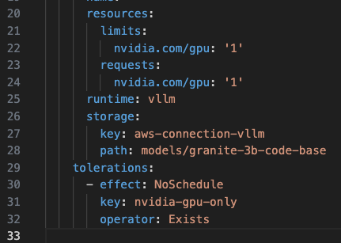

# Explore LLMs

In the https://github.com/redhat-ai-services/ai-accelerator[ai-accelerator project], there is an example of an LLM. Let's look at the https://github.com/redhat-ai-services/ai-accelerator/tree/main/tenants/ai-example/single-model-serving-tgis[single-model-serving-tgis] example.

This inference service uses https://huggingface.co/google/flan-t5-small[flan-t5-small] model.

The model has been uploaded to minio S3 automatically when we ran the bootstrap script. The inference service uses the _TGIS Standalone ServingRuntime for KServe_ and is _**not**_ using a GPU.

Take a look at the InferenceService and the ServingRuntime resource in your _**Demo**_ cluster.

Now let's take a look at the https://github.com/redhat-ai-services/ai-accelerator/tree/main/tenants/ai-example/single-model-serving-vllm[single-model-serving-vllm] example.

This inference service uses IBM's https://huggingface.co/ibm-granite/granite-3b-code-base[granite-3b-code-base] model.

The Inference Service uses a vllm ServingRuntime which can be found https://github.com/rh-aiservices-bu/llm-on-openshift/blob/main/serving-runtimes/vllm_runtime/vllm-runtime.yaml[here].

Notice in the InferenceService of the vllm example there are GPU sections:

As you can see in the resources section, this Inference Service is needing a gpu to function properly.

You can also see that there is a `toleration` policy. When using the toleration on this resource, it is telling the cluster to deploy on a node that has a GPU attached to it so it can use it. It does this by using the toleration and a taint.

In this case, a node with a taint is a node with a GPU attached to it. The toleration has a key to validate against the taint. If it matches, the pod can run on the node.

In the test folders of the examples, there are notebooks that we can use to test out the inference service.