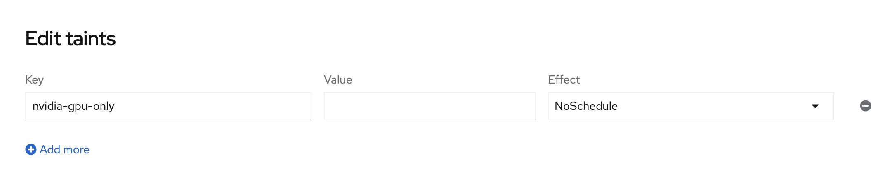
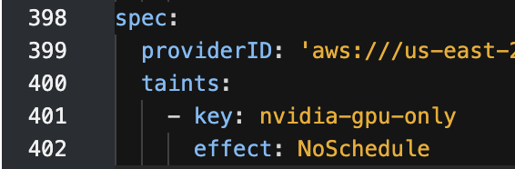
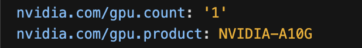
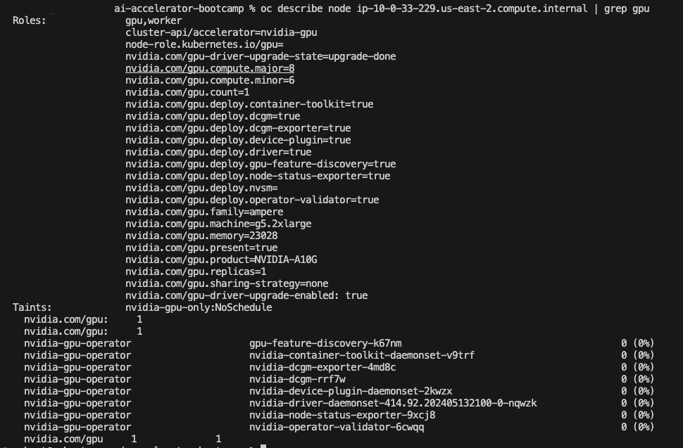

# Explore LLMs

In the https://github.com/redhat-ai-services/ai-accelerator[ai-accelerator project], there is an example of an LLM. Let's look at the https://github.com/redhat-ai-services/ai-accelerator/tree/main/tenants/ai-example/single-model-serving-tgis[single-model-serving-tgis] example.

This inference service uses https://huggingface.co/google/flan-t5-small[flan-t5-small] model.

The model has been uploaded to minio S3 automatically when we ran the bootstrap script. The inference service uses the _TGIS Standalone ServingRuntime for KServe_ and is _**not**_ using a GPU.

Take a look at the InferenceService and the ServingRuntime resource in your _**Demo**_ cluster.

Now let's take a look at the https://github.com/redhat-ai-services/ai-accelerator/tree/main/tenants/ai-example/single-model-serving-vllm[single-model-serving-vllm] example. This inference service uses IBM's https://huggingface.co/ibm-granite/granite-3b-code-base[granite-3b-code-base] model.

The Inference Service uses a vllm ServingRuntime which can be found https://github.com/rh-aiservices-bu/llm-on-openshift/blob/main/serving-runtimes/vllm_runtime/vllm-runtime.yaml[here].

### Nodes and Taints
Notice in the InferenceService of the vllm example there are GPU sections:

image::images/vllm_gpu.png[]

As you can see in the resources section, this Inference Service is needing a gpu to function properly.

You can also see that there is a `toleration` policy. When using the toleration on this resource, it is telling the cluster to deploy on a node that has a GPU attached to it so it can use it. It does this by using the toleration and a taint.

In this case, a node with a taint is a node with a GPU attached to it. The toleration has a key to validate against the taint. If it matches, the pod can run on the node.

Let's take a look at the node:

In `OpenShift Dashboard > Compute > Nodes` we can see we have 3 nodes. Let's look at the one with the gpu.

image::images/nodes.png[]

Select the GPU node. The instance is g5.2xlarge which has a gpu. You can see the different type of instances here: https://aws.amazon.com/ec2/instance-types/[]

If we look at the node details and scroll down we can see the taint that is has.

We can also see it in the yaml.

In the node yaml we can view the labels associated with the node. Lets look at the the `nvidia.com/*` labels. As you can see we have: `nvidia.com/gpu.count: '1'` which tells us that we have a gpu attached to this node

We can also run a `oc describe`` on the node:

`oc describe node ip-**-*-**-***.us-east-2.compute.internal | grep gpu` 

### Test Model Notebooks
After exploring the GPU Node details, open RHOAI and launch new workbench and run the tests for the LLMs. These can be found in the `https://github.com/redhat-ai-services/ai-accelerator` [] 

- tenants/ai-example/multi-model-serving/test
- tenants/ai-example/single-model-serving-tgis/test
- tenants/ai-example/single-model-serving-vllm/test

These are very simple tests to make sure that the InferenceService is working. View the logs of the inference service pod while you test.