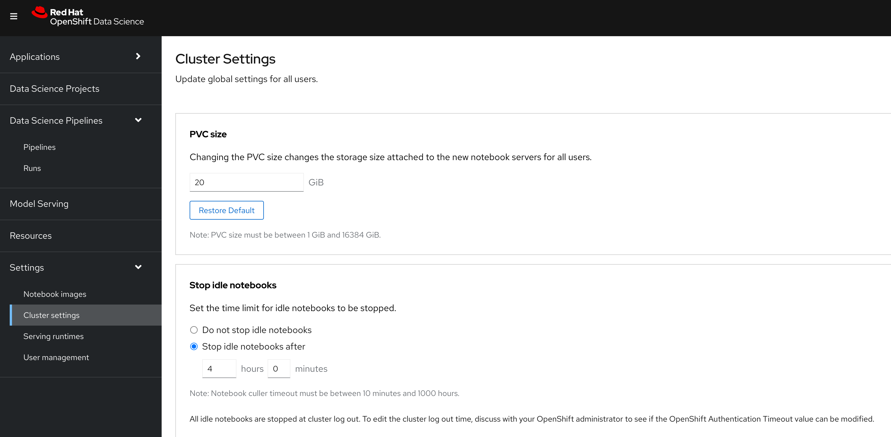

# RHOAI Dashboard Configuration

## RHOAI Dashboard Resources

Many of the objects in Red Hat OpenShift AI (RHOAI) are tied to an underlying Kubernetes resource. Because of this connection, many RHOAI objects can be created, updated, or deleted by performing the respective action on the underlying resource. Although some of these resources use a custom resource definition (CRD), many do not. For example, Data Science Projects are Red Hat OpenShift projects that include specific labels.

## Idle Notebook Culling:

Notebooks and workbenches can consume many compute resources. Additionally, users might forget to shut them down when they are finished, which consumes cluster resources unnecessarily.

The Idle Notebook Culler helps reduce the number of inactive notebooks running on the cluster. It tracks the last time an action was taken in a notebook and shuts down the pods if the notebook has been inactive for a period of time. A notebook is considered inactive when no user has taken an action inside of the notebook. Actions include executing a cell, creating files, or interacting with the user interface.



In RHOAI Dashboard>Settings>Cluster Settings>Stop idle notebooks:
When enabled is selected and saved, the ConfigMap below will be created. You can enable culling outside of RHOAI Dashboard by applying this ConfigMap to `redhat-ods-applications` namespace.

Apply ConfigMap in `redhat-ods-applications`.
__CULL_IDLE_TIME__ and __IDLENESS_CHECK_PERIOD__ is in minutes. __ENABLE_CULLING__ is false by default.

```
kind: ConfigMap
apiVersion: v1
metadata:
  name: notebook-controller-culler-config
  namespace: redhat-ods-applications
  labels:
    opendatahub.io/dashboard: 'true'
data:
  CULL_IDLE_TIME: '60'
  ENABLE_CULLING: 'true'
  IDLENESS_CHECK_PERIOD: '1'
```

NOTE: In RHOAI Dashboard>Settings>Cluster Settings>Stop idle notebooks
If culling is enabled by ConfigMap, but then disabled in RHOAI Dashboard settings. The ConfigMap `notebook-controller-culler-config` will be deleted. 


## Workbench and Model Server Sizes

When launching workbenches or model servers from the RHOAI dashboard, users can select from several default sizes. These default options might not suit your organization's needs. In such cases, you can use custom model server and notebook size configurations. To do this edit the `odh-dashboard-config` OdhDashboardConfig resource in namespace `redhat-ods-applications`. You can use the OpenShift Dashboard -> Search or navigate to Home -> API explorer and filter ford `OdhDashboardConfig`:

```
apiVersion: opendatahub.io/v1alpha
kind: OdhDashboardConfig
metadata:
  annotations:
    internal.config.kubernetes.io/previousKinds: OdhDashboardConfig
    internal.config.kubernetes.io/previousNames: odh-dashboard-config
    internal.config.kubernetes.io/previousNamespaces: default
  name: odh-dashboard-config
  namespace: redhat-ods-applications
  labels:
    app.kubernetes.io/part-of: rhods-dashboard
    app.opendatahub.io/rhods-dashboard: 'true'
spec:
...output omitted...
  modelServerSizes:
    - name: Small
      resources:
        limits:
          cpu: '2'
          memory: 8Gi
        requests:
          cpu: '1'
          memory: 4Gi
  ...output omitted...
  notebookSizes:
    - name: Small
      resources:
        limits:
          cpu: '2'
          memory: 8Gi
        requests:
          cpu: '1'
          memory: 8Gi
    ...output omitted..

```

After making changes and saving, give the RHOAI Dashboard a few minutes to update. The changes should now be available.